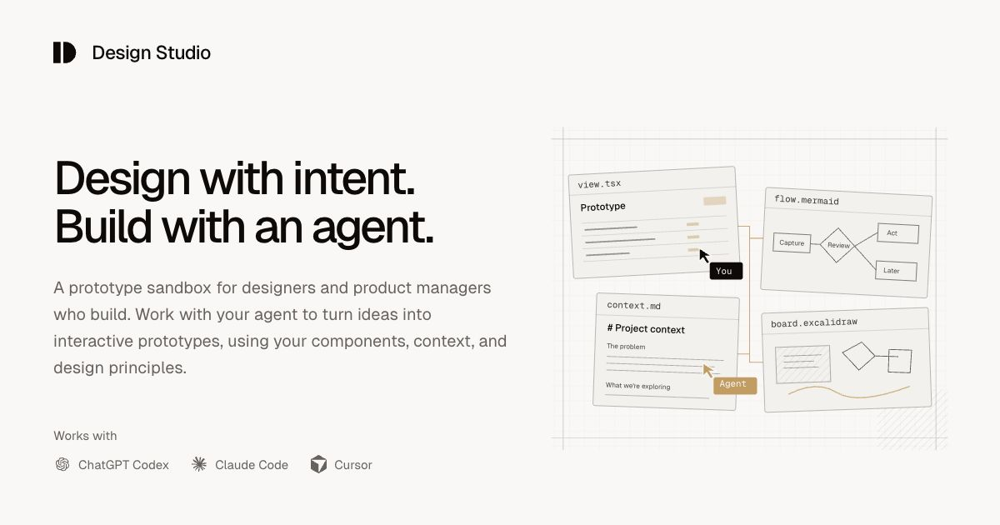

# Design Studio Starter

An open-source, local prototype sandbox for designers and product managers who build with coding agents. Turn ideas into interactive prototypes, keep the thinking behind them close, and shape an environment that fits your team.

**[View demo](https://itspatmorgan.com/design-studio-starter/) · [Set up Design Studio](SETUP.md)**

## What you can do

- **Connect the whole idea.** Keep working prototypes, diagrams, canvases, and documents together as you explore and refine a flow.
- **Give your agent a foundation.** Bring together your components, theme, product context, and instructions so prototypes reflect your team's design system.
- **Make it yours.** Start with included examples, customize the studio, and own the code and everything you create. Work individually or with a team.

## Get started

Use Codex, Claude Code, or Cursor in a local desktop session. Copy one prompt from [the setup guide](SETUP.md) to install the plugin and create your studio. Your agent handles setup and opens it on your computer.

The guide also covers [direct setup without a plugin](SETUP.md#4-direct-from-the-source-repository) and [manual installation](SETUP.md#manual-installation). If ChatGPT Sites is available, the [setup-and-publish prompt](SETUP.md#set-up-and-publish-with-chatgpt-sites) includes a viewing link you can share. Editing stays local.

## Explore further

Design Studio is in early beta. Explore the examples, then ask your agent to help build your first prototype.

- [Manual](src/modules/documentation/pages/index.md) — using and customizing your studio.
- [Modules](src/platform/context/modules.md) — extending its capabilities.
- [Contributing](CONTRIBUTING.md) — feedback, issues, and pull requests.
- [Changelog](CHANGELOG.md) — what's changed.

Created by **[Patrick Morgan](https://itspatmorgan.com)**. Follow the thinking behind the work at [Unknown Arts](https://www.unknownarts.com/).

## License

[MIT](LICENSE). Includes [Flexoki](https://stephango.com/flexoki) by Steph Ango (MIT) and [Pragmatic drag and drop](https://atlassian.design/components/pragmatic-drag-and-drop/) by Atlassian (Apache-2.0).
