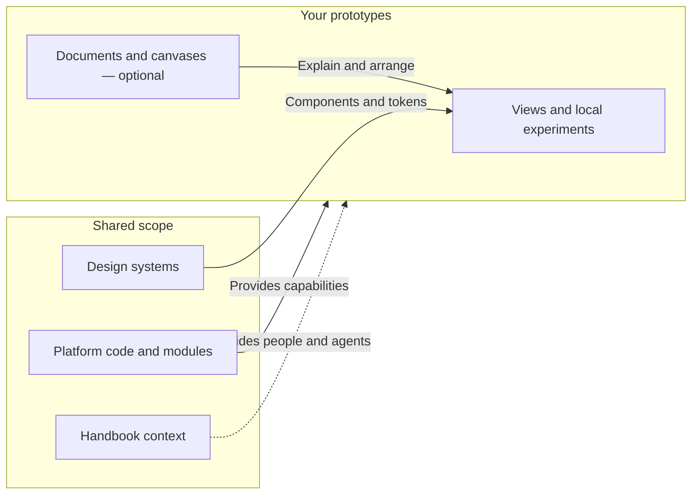
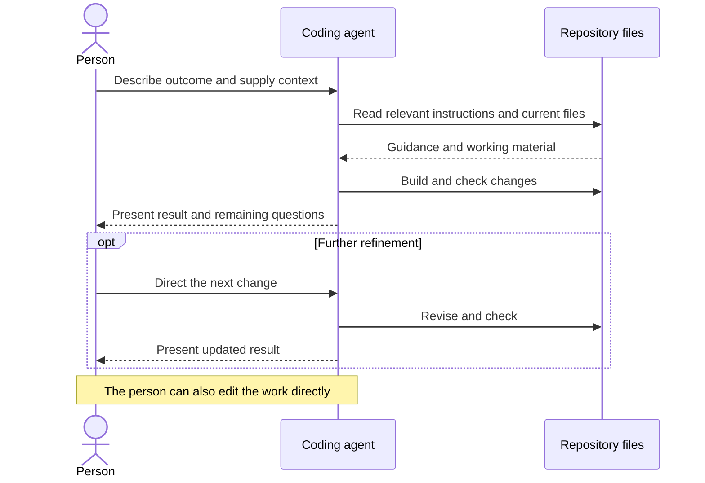
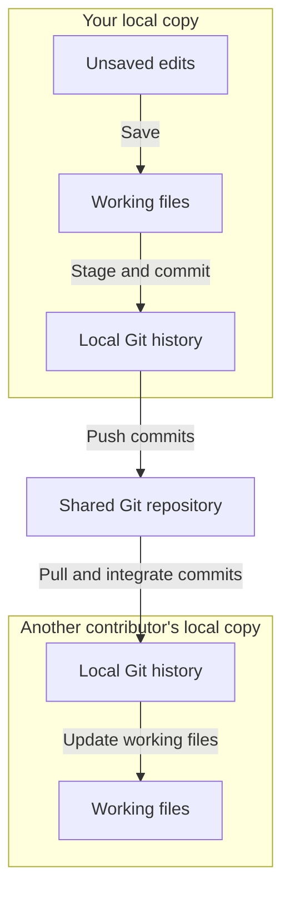
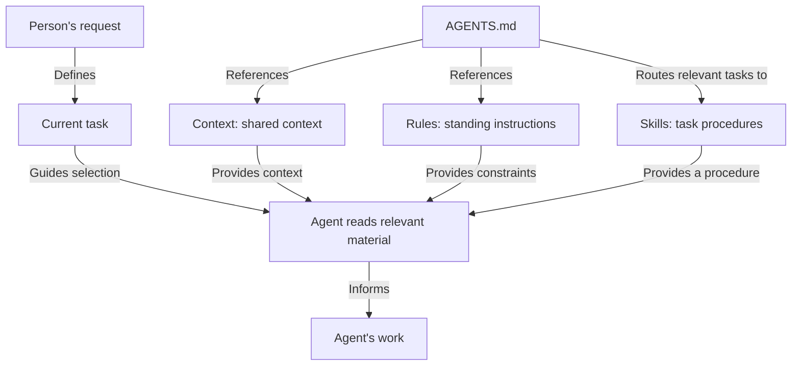
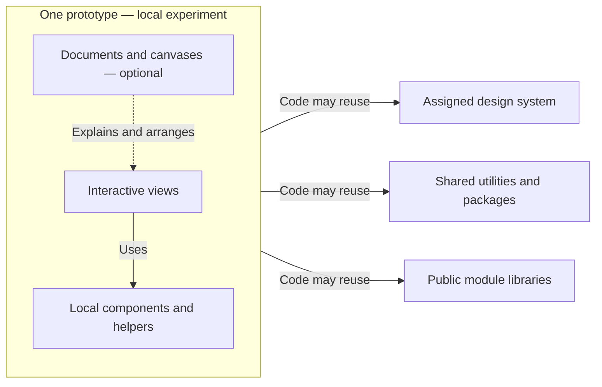

This is a review workspace, not an authoritative description or a new set of agent instructions. The diagrams model existing behavior, but their selection, wording, and placement are proposals. Refine them here before moving accepted diagrams into the Guide and module documentation. The existing pages remain unchanged.

## Working approach

Start with the [documented personas](personas.md): designers and product managers who build with agents. Engineering partners need clear setup and handoff context. The studio owner is a responsibility one of these people may take on.

Each diagram should help someone understand what they own, where they can work safely, or how work moves through the studio. Model the relationships that answer that question, then choose the Mermaid type. Implementation diagrams belong in developer references when a concrete need emerges. Module lifecycle and canvas saving are deferred from this review.

- Use boundaries for containment or scope, labelled arrows for relationships, sequences for exchanges, and states for lifecycle changes.
- Keep each diagram focused. Put details in accompanying text or a separate diagram.
- Name what an arrow means. A dependency, a file transfer, and guidance from context are different relationships.
- Keep optional capabilities explicit. Separate instructions from enforcement and local behavior from publication.
- Use the same terms in the diagram and the prose. Include accessible titles and descriptions.
- Keep colors meaningful. The shared theme supplies the default appearance.

These are candidate conventions to evaluate against the examples below. They are not additions to the standing documentation rules yet.

| Proposal | Reader's question | Type | Intended destination |
| --- | --- | --- | --- |
| Studio structure and ownership | What is mine, what is shared, and where do modules fit? | Structural flowchart | Guide introduction |
| Agent collaboration | Who does what during an iteration? | Sequence | Work with your agent |
| Sharing files | Where do changes exist after each action? | Flowchart | Share work |
| Instruction context | How does the agent find relevant guidance? | Relationship flowchart | Handbook / agent guidance |
| Prototype scope and dependencies | What belongs in my experiment, and what can it reuse? | Dependency flowchart | Prototype boundaries |

## 1. Studio structure and ownership

**Who this helps:** Designers and product managers finding their working area; studio owners coordinating shared changes.

**What they should understand:** Their prototypes are independent working spaces. Shared resources and platform capabilities serve the whole studio and need coordinated changes.

**Question:** What is mine, what is shared, and where do modules fit?

Boundaries show change scope. Labelled arrows show how shared resources and the platform support a prototype.

**Reading:** You own the code and can adapt the studio. These boundaries describe collaboration scope, not access controls. Your registered contributor area is the default place for independent work. Platform code, design systems, utilities, configuration, and Handbook content are shared. An explicit request can authorize shared changes; work in another owner's prototype follows their review process.

Modules organize platform capabilities. The Systems module supports design systems; the design-system content itself lives separately. Documents and Canvases are optional modules, while views remain core. The dashed Handbook arrow means guidance, not a code dependency.

**Review focus:** Can a new contributor identify their working area and recognize when a change affects the team? Do modules feel like capabilities supporting the workspace?

**Sources:** [Guide introduction](../../platform/modules/guide/pages/index.md), [Extend your Studio](../../platform/modules/guide/pages/modules.md), [Contributor scope](../rules/contributor-scope.md).

## 2. Agent collaboration

**Who this helps:** Designers and product managers directing work through an agent.

**What they should understand:** They supply intent and judge results; the agent reads context, implements, and checks. Direct edits remain part of the workflow.

**Question:** Who directs, executes, and reviews the work?

A sequence makes responsibilities explicit. It includes context access without implying that the studio provides a hosted agent service.

**Reading:** This models one iteration, not an enforced workflow. Checks can fail and the agent may need clarification before building.

**Review focus:** Does the sequence clarify responsibility better than the current three-node cycle? Should repeated refinement be a loop, or is one optional revision easier to read?

**Source:** [Work with your agent](../../platform/modules/guide/pages/agents.md).

## 3. Sharing files

**Who this helps:** Designers and product managers sharing work with teammates, including engineering handoff recipients.

**What they should understand:** Saving stays local; a commit records a version; push and pull exchange those recorded changes. A viewing site is published separately.

**Question:** What moves when I save, commit, push, or pull?

This separates local files from Git history. Publishing is a distinct activity described below the diagram.

**Reading:** Git history is the record of committed versions. Saving alone does not share work with teammates. Pulling includes receiving and integrating changes; conflicts may need resolution. The diagram abstracts the team's branching and review process. Publishing builds a viewing site through a configured host; pushing alone does not do that.

**Review focus:** Is the distinction between files and history worth the extra nodes? Would publication be clearer as a separate diagram on the publishing page?

**Source:** [Share work](../../platform/modules/guide/pages/working-with-others.md).

## 4. Instruction context

**Who this helps:** Designers and product managers supplying product context; studio owners curating shared guidance.

**What they should understand:** Context explain the product and people; Rules set standing requirements; Skills describe task procedures. References help the agent find relevant material.

**Question:** How does shared knowledge become relevant to an agent's task?

This models references and selection rather than automatic execution. Context, Rules, and Skills serve different purposes.

**Reading:** Presence in the Handbook does not guarantee that a file is read. This is a repository guidance model, not a complete model of an agent's instruction hierarchy. Scripts and build checks perform verification separately.

**Review focus:** Can we simplify the converging arrows without suggesting that every file is always loaded? Does “routes” communicate the role of AGENTS.md clearly?

**Sources:** [Handbook](../../platform/modules/handbook/README.md), [Work with your agent](../../platform/modules/guide/pages/agents.md).

## 5. Prototype scope and dependencies

**Who this helps:** Designers and product managers directing a local experiment; engineering partners identifying reusable components and prototype-specific code.

**What they should understand:** A prototype keeps its views and helpers together. It reuses its assigned design system and allowed shared tools without reaching into another prototype or private platform code.

**Question:** What belongs in my experiment, and what can it reuse?

The boundary shows local work. Arrows leaving it mean “may reuse in code.” Keep detailed import syntax in the linked reference.

**Reading:** New components can stay local while an idea develops. Moving an experiment into the shared design system is a coordinated shared change. Other prototypes, other design systems, and private platform code remain outside the allowed code dependencies. Documents and canvases provide context alongside views; the dashed arrow represents that relationship.

For agents and engineering partners: public module libraries are accessed through `@module/<id>`. An enabled module does not automatically expose a library. Shared utilities remain independent of prototypes, systems, and platform code. Indirect and type-only dependencies follow the same boundaries.

**Review focus:** Can someone distinguish local experimentation from changing a shared foundation? Does the diagram help an engineer recognize what can be reused during handoff?

**Sources:** [Prototype workflow](../rules/prototype-workflow.md), [Prototypes](../../platform/modules/prototypes/README.md), [Contributor scope](../rules/contributor-scope.md).

## Decisions to make after review

1. Check whether each intended reader can explain the diagram in their own words.
2. Choose the smallest accurate model of ownership, safe scope, or collaboration.
3. Refine node names, arrow labels, and explanatory text together.
4. Check light and dark appearance, long labels, and document-width layouts.
5. Move accepted diagrams to their authoritative pages. Remove the corresponding draft sections to avoid a second contract.
6. Promote only useful conventions into [Documentation standards](../rules/documentation-standards.md).
