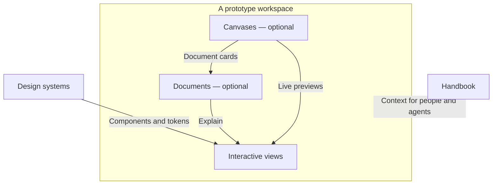
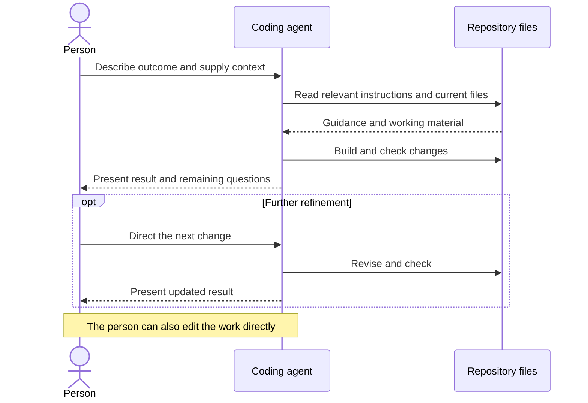
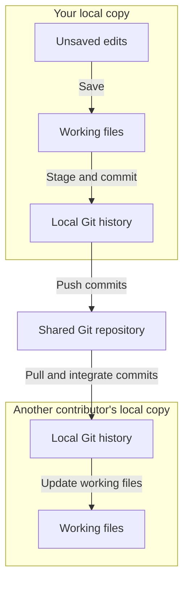
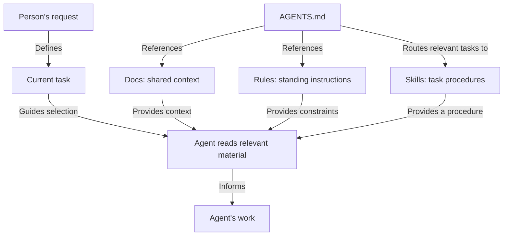
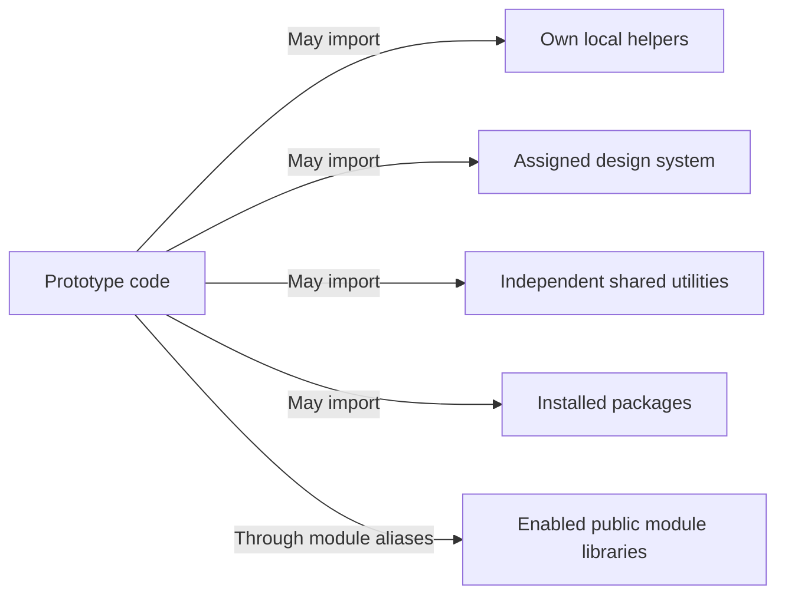
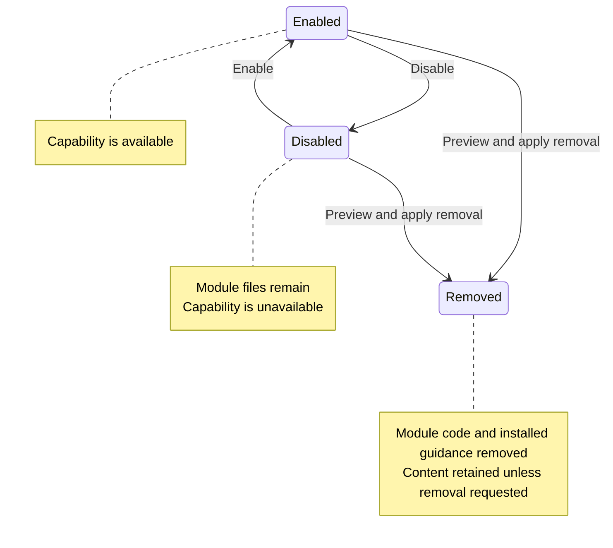
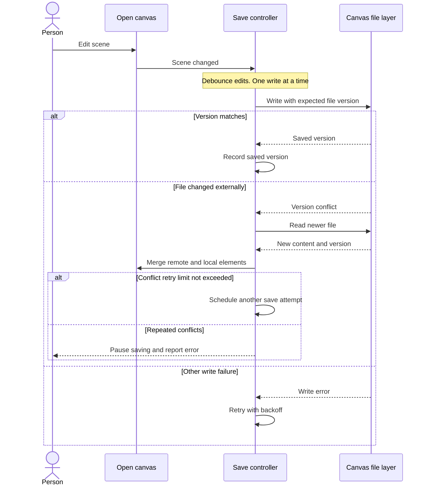

This is a review workspace, not an authoritative description or a new set of agent instructions. The diagrams model existing behavior, but their selection, wording, and placement are proposals. Refine them here before moving accepted diagrams into the Guide and module documentation. The existing pages remain unchanged.

## Working approach

Start with a question the reader needs answered. Model the relationships that answer it, then choose the Mermaid type.

- Use boundaries for containment or scope, labelled arrows for relationships, sequences for exchanges, and states for lifecycle changes.
- Keep each diagram focused. Put details in accompanying text or a separate diagram.
- Name what an arrow means. A dependency, a file transfer, and guidance from context are different relationships.
- Keep optional capabilities explicit. Separate instructions from enforcement and local behavior from publication.
- Use the same terms in the diagram and the prose. Include accessible titles and descriptions.
- Keep colors meaningful. The shared theme supplies the default appearance.

These are candidate conventions to evaluate against the examples below. They are not additions to the standing documentation rules yet.

| Proposal | Reader's question | Type | Intended destination |
| --- | --- | --- | --- |
| Studio structure | What belongs where, and how do the parts relate? | Structural flowchart | Guide introduction |
| Agent collaboration | Who does what during an iteration? | Sequence | Work with your agent |
| Sharing files | Where do changes exist after each action? | Flowchart | Share work |
| Instruction context | How does the agent find relevant guidance? | Relationship flowchart | Handbook / agent guidance |
| Prototype dependencies | What can a prototype import? | Dependency flowchart | Prototype boundaries |
| Optional modules | What changes when a capability is disabled or removed? | State | Module documentation |
| Canvas saving | How do local and external edits reach the file? | Sequence | Canvas developer documentation |

## 1. Studio structure

**Question:** What belongs in a prototype, and how do shared resources support it?

The current introduction diagram emphasizes contributor separation. This proposal emphasizes the composition of one workspace. Contributor ownership can be explained on its own page.

**Reading:** Boxes inside the prototype belong to that workspace. The dashed Handbook relationship represents guidance for people and agents, rather than a runtime import.

**Review focus:** Does this communicate the studio's composition without becoming an implementation diagram? Is the distinction between a document link and a live canvas preview clear enough?

**Sources:** [Guide introduction](../../platform/modules/guide/pages/index.md), [Prototypes](../../platform/modules/prototypes/README.md), [Documents](../../platform/modules/document/README.md), [Canvases](../../platform/modules/canvas/README.md).

## 2. Agent collaboration

**Question:** Who directs, executes, and reviews the work?

A sequence makes responsibilities explicit. It includes context access without implying that the studio provides a hosted agent service.

**Reading:** This models one iteration, not an enforced workflow. Checks can fail and the agent may need clarification before building.

**Review focus:** Does the sequence clarify responsibility better than the current three-node cycle? Should repeated refinement be a loop, or is one optional revision easier to read?

**Source:** [Work with your agent](../../platform/modules/guide/pages/agents.md).

## 3. Sharing files

**Question:** What moves when I save, commit, push, or pull?

This separates local files from Git history. Publishing is a distinct activity described below the diagram.

**Reading:** Pulling includes receiving and integrating changes; conflicts may need resolution. The diagram abstracts the team's branching and review process. Publishing builds a viewing site through a configured host; pushing alone does not do that.

**Review focus:** Is the distinction between files and history worth the extra nodes? Would publication be clearer as a separate diagram on the publishing page?

**Source:** [Share work](../../platform/modules/guide/pages/working-with-others.md).

## 4. Instruction context

**Question:** How does shared knowledge become relevant to an agent's task?

This models references and selection rather than automatic execution. Docs, Rules, and Skills serve different purposes.

**Reading:** Presence in the Handbook does not guarantee that a file is read. This is a repository guidance model, not a complete model of an agent's instruction hierarchy. Scripts and build checks perform verification separately.

**Review focus:** Can we simplify the converging arrows without suggesting that every file is always loaded? Does “routes” communicate the role of AGENTS.md clearly?

**Sources:** [Handbook](../../platform/modules/handbook/README.md), [Work with your agent](../../platform/modules/guide/pages/agents.md).

## 5. Prototype dependencies

**Question:** What is a prototype allowed to import?

Every arrow means “may import from.” Allowed targets form the diagram; the exclusions stay in prose to avoid a web of warning arrows.

**Reading:** The same boundaries apply to indirect and type-only dependencies. Private platform code, another prototype, and another design system are excluded. Shared utilities must remain independent of prototypes, systems, and platform code. An enabled module does not automatically expose a public library.

**Review focus:** Is the import direction unmistakable? Does this belong in the detailed boundary reference rather than the introduction?

**Source:** [Prototype workflow](../rules/prototype-workflow.md).

## 6. Optional module lifecycle

**Question:** How does disabling differ from removing a capability?

This applies only to optional modules. Required modules cannot follow these transitions through the studio commands.

**Reading:** Removal can be blocked by dependencies. For optional prototype file types, disabling hides their items from normal navigation and retains their files. Restart the dev server after module changes. Reinstallation is a separate operation and is omitted here to keep the distinction focused.

**Review focus:** Are these three states enough, or would a simpler comparison table explain the choice better? Does the diagram clearly preserve the difference between module code and user content?

**Sources:** [Extend your Studio](../../platform/modules/guide/pages/modules.md), [Module contract](../../platform/modules/README.md).

## 7. Canvas saving

**Question:** What happens when local canvas edits meet an external file change?

This is a developer diagram for the optional Canvases module. It shows one save attempt with simplified recovery branches.

**Reading:** The successful branch can still have newer unsaved edits waiting for the next write. Independent file updates also appear in the canvas; with no pending edits, the file replaces the scene instead of merging. Published canvases are read-only.

**Review focus:** Is this enough detail to explain concurrency, or should conflict recovery become a separate diagram? Keep the main human-facing canvas chapter simpler.

**Sources:** [Canvases](../../platform/modules/canvas/README.md), implementation in `src/platform/modules/canvas/useCanvasFile.ts` and `mergeRemote.ts`.

## Decisions to make after review

1. Choose the smallest model that answers each question accurately.
2. Refine node names, arrow labels, and explanatory text together.
3. Check light and dark appearance, long labels, and document-width layouts.
4. Move accepted diagrams to their authoritative pages. Remove or replace the corresponding draft sections so this does not become a second contract.
5. Promote only the conventions that proved useful into [Documentation standards](documentation-standards.md).
