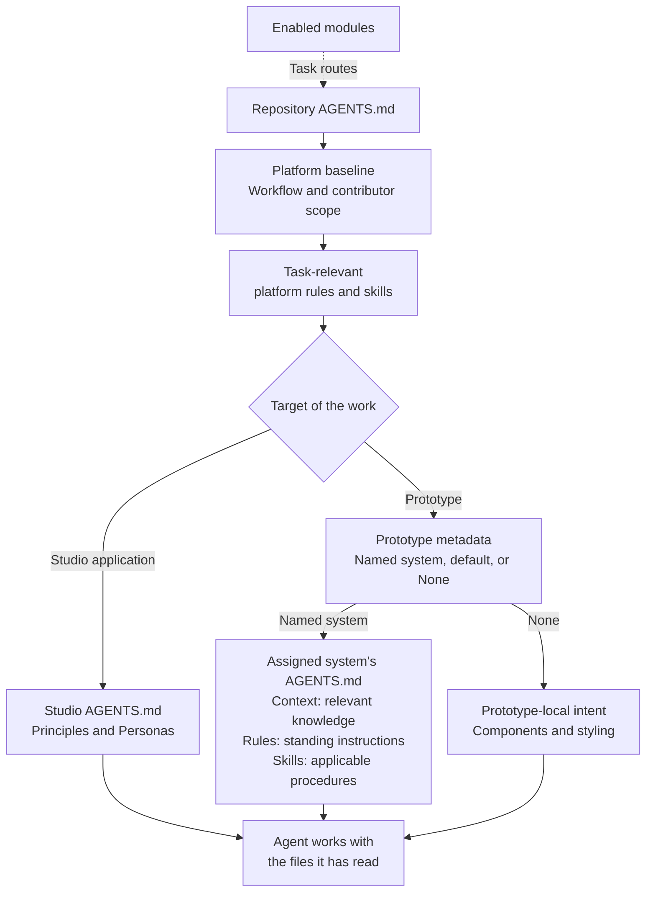

Your agent starts with the repository's operating instructions, then follows routes for the work you request. A prototype's assigned system determines which product context, rules, and skills it should read.

## Follow the context flow

This diagram shows the reading flow. Studio provides the files and routes. Your coding agent reads them; Studio does not automatically inject their contents into the conversation.

The platform baseline remains in every branch. Selecting a product system adds its instructions to the task; it does not remove Studio's operating rules.

Studio rules direct the agent’s operating behavior; core and module contracts define the technical requirements it works within. [Platform and system responsibilities](/documentation/reference/platform/core/contracts-and-instructions.md) explains which source owns each responsibility.

## Understand the layers

| Layer | What it contributes |
| --- | --- |
| Repository instructions | Scope, operating requirements, and links for choosing further instructions. |
| Task routes | Rules and procedures relevant to the requested work, including enabled modules. |
| System context | Knowledge about the people, domain, and intent of that system. |
| System rules | Standing requirements that shape decisions. |
| System skills | Procedures selected for a particular task, with supporting files when needed. |
| Prototype intent | Your request and the prototype's own documents and implementation. |

Skills are selected by their names, descriptions, and linked task conditions. The agent reads the applicable procedure, then its required references. It should not load unrelated systems just because their files are available.

## Which system applies?

An explicit system assignment selects that system. An explicit **None** assignment selects no system. Older prototypes with no assignment use the configured default.

Directly changing the configured default affects prototypes that omit an assignment. The studio configuration command first records those assignments to preserve existing choices. Explicit assignments stay the same. Choosing a system in the browser only changes what you are browsing.

For example, **Design Studio Marketing** explicitly uses Marketing. Its system instructions link to Brand and Library context and the Marketing Design rule. An agent editing that prototype follows those links along with the platform rules. Product context is outside that task unless your request makes it relevant.

A prototype with **None** keeps the same platform rules and uses its own components and styles. It does not silently inherit Product or Marketing instructions.

## What is automatic?

Your coding agent's host decides how it discovers the repository's `AGENTS.md`. Studio maintains file-based instructions and diagnostic information. It does not control what your agent host automatically reads.

Files shown in Resources are available to read. Their presence does not mean they were added to a conversation. Likewise, system skills are not automatically installed in every agent host.

Repository instructions ask the agent to reuse unchanged instructions already available in the conversation and retain full check logs locally. Required context and checks still apply. Your agent host controls how much conversation context remains available; Studio does not manage that window.

When you add important system knowledge, ask the agent to connect it to the system's instructions. When you manually change module configuration, run `pnpm studio sync` to refresh the repository's task routes.

## Check the routing

The diagnostic instruction map inventories rule routes and skills. Build checks also find missing local files reached through system instructions, including context and skill references. These checks catch broken routing; they do not prove that an agent read or followed a file.

For a task you want to verify, ask your agent to explain the resolved system and the instructions it used. Compare that answer with the target prototype and your request.

The [Agent context routing](/documentation/reference/platform/core/agent-context.md) provides the detailed resolution and validation boundaries.
