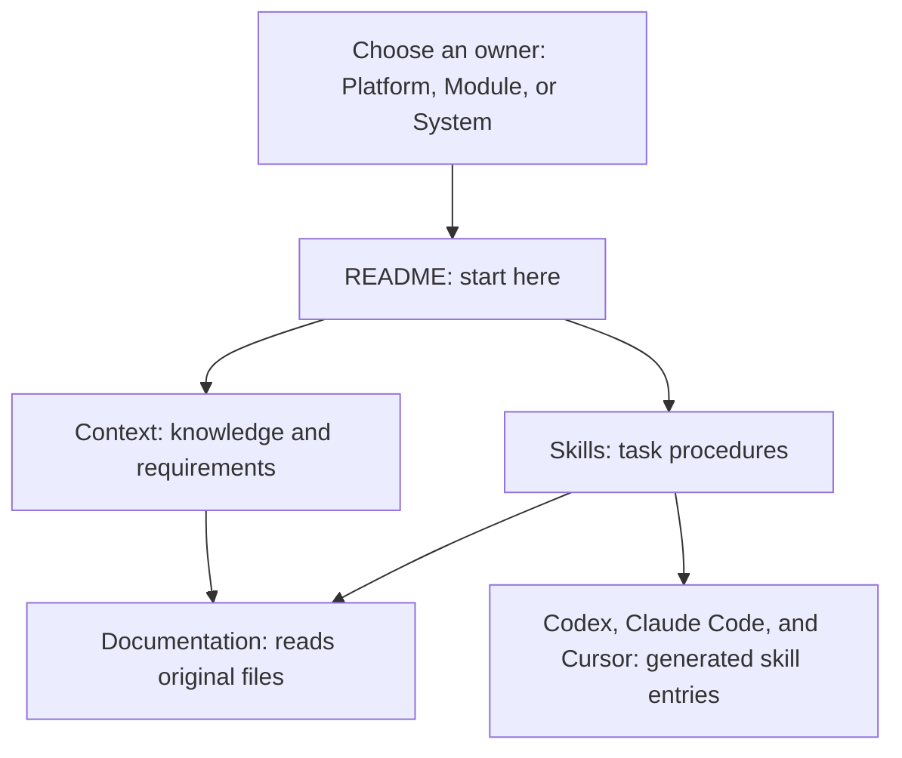

Ask for the result you want. Your agent uses skills for the task and context to make decisions that fit your work.

## Find guidance

Every owner has a README entry point, context for knowledge and requirements, and skills for tasks. Documentation’s Context & Skills browser displays these original files together. Select Platform, a module, or a system; start with Overview, then read relevant context or skills.

The platform’s detailed configuration, file-format, and runtime requirements are technical context. They appear under Context → Technical. They are part of the same knowledge model as principles and personas.

## Context and skills

Context includes product knowledge, personas, principles, and standing conventions. Skills explain how to accomplish a task and verify it. Both have an owner:

| Owner | Examples |
| --- | --- |
| Platform | Studio setup, collaboration, and shared working requirements. |
| Module | Building a prototype, using a canvas, or writing a document. |
| System | Product audiences, brand direction, writing conventions, and specialized design tasks. |

The platform and modules keep their own guidance. Studio's design system supplies the application's interface toolkit and writing conventions. Your product system owns your team's product guidance.

## Which system applies?

Your prototype's assignment selects its product guidance. An explicit None assignment uses local components and styling. Only an omitted assignment follows the studio default. Changing the system you browse does not change the assignment.

An agent editing a Marketing prototype reads Marketing guidance alongside platform requirements and the relevant module skill. It should not use Product guidance unless the request calls for it. A pending system rebuild also requires the requested target system's guidance while preserving the original exploration.

## Skill discovery

Studio exposes project skills to Codex, Claude Code, and Cursor when the repository is prepared. The plugin helps create or reopen the studio and continue in its working folder. The project supplies the current operating procedures.

Skills are considered by name and description. Their full instructions and supporting references are read when relevant. Files visible in navigation are available; visibility does not prove an agent has read them.

Ask your agent to refresh skill exposure after adding skills or changing available modules. It uses `pnpm studio sync`. Open a new session or refresh the host if its skill list has not updated.

## Verify context selection

Ask your agent which system applies and which instructions it used. Check the resulting work as well as that explanation. Automated checks find broken links and invalid structures; they do not prove correct agent decisions.

See [Agent context routing](/documentation/context/platform.core/context/technical/agent-context) for technical details.
