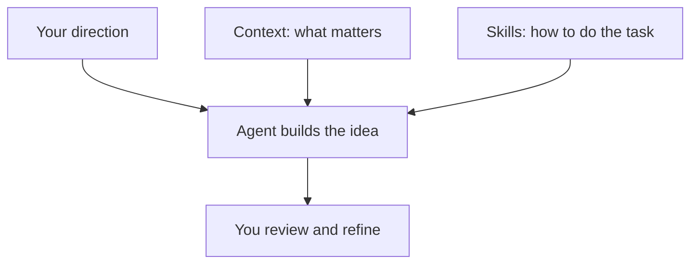

Your agent can build a prototype from a description. To make it feel like your product, it also needs to understand your customers, your goals, and your team's design standards.

Design Studio keeps that shared knowledge alongside your work. You can review it, refine it, and ask your agent to use it as you explore ideas.

## Context and skills

**Context** explains what matters. It might describe who your product serves, how your brand sounds, or which design principles guide your team.

**Skills** explain how to do something in Studio, such as build a prototype or create a diagram. Your agent uses the relevant skill to carry out your request.

For example, ask for a sign-up flow for your product. Your audience context helps the agent choose what to explain. Your writing guidance shapes the copy. The prototype skill helps it build a flow you can try.

## Where to find guidance

Open **Systems** and choose your product's system to find its **Context** and **Skills**. This is where your team's audience, principles, and design guidance belong. A system brings this knowledge together with the styles and components your prototypes use.

Open **Documentation → Context & Skills** to explore guidance about Studio and its capabilities. Each **README** introduces that part of Studio. You can browse these documents when you want to understand how something works.

To update shared guidance, ask your agent. For example:

> Add this to our product's writing guidance: use short, direct sentences and explain unfamiliar terms.

## Explore the Agents section

| Chapter | What you can learn |
| --- | --- |
| [Plugin and workspace](/documentation/guide/agent-plugin) | Start or reopen a studio with your agent. |
| [Skill discovery](/documentation/guide/agent-skills) | Understand how your agent finds help for a task. |
| [Task context](/documentation/guide/agent-task-context) | Give your agent useful direction for a prototype. |
| [Maintaining guidance](/documentation/guide/agent-maintenance) | Keep shared knowledge useful as your product changes. |
