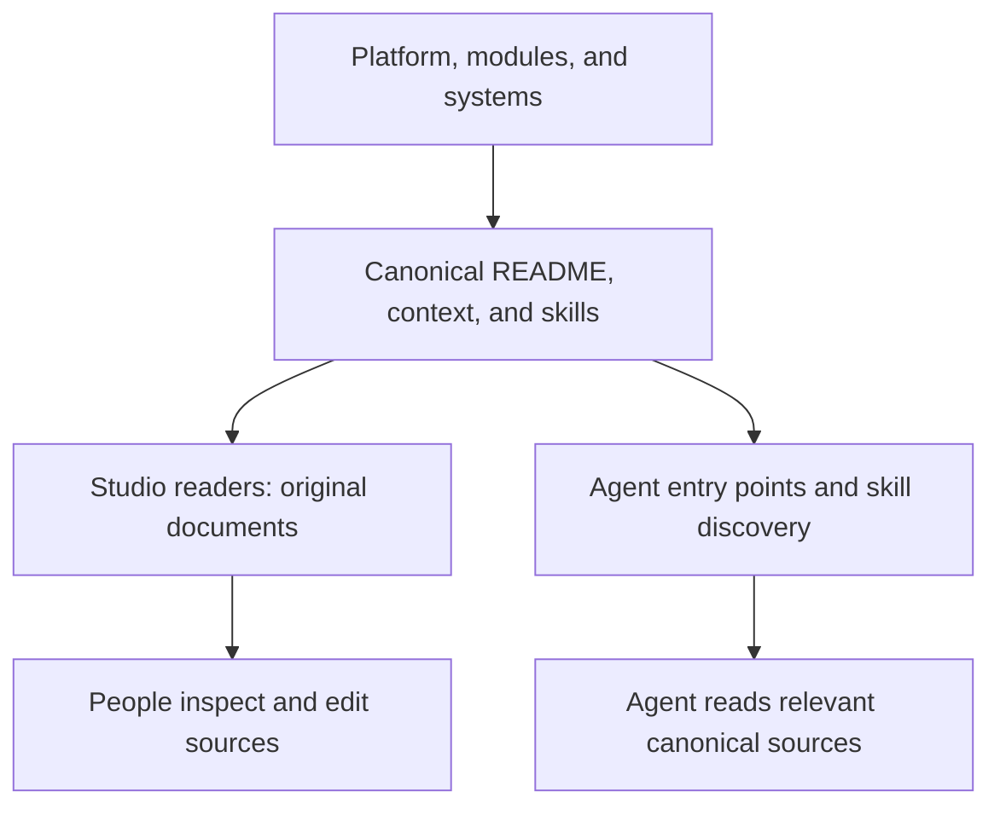

Design Studio keeps its instructions in the repository you own. Context explains what the agent needs to know. Skills explain how to perform a task. The plugin helps the agent enter that repository; the repository supplies the current working guidance.

This section explains the agent system from several viewpoints. Discovery makes guidance available; the agent still needs to select and read relevant sources.

| Chapter | What it explains |
| --- | --- |
| This page | Source ownership and where people can inspect it. |
| [Plugin and workspace](/documentation/guide/agent-plugin) | Entering a studio and handing off to its procedures. |
| [Skill discovery](/documentation/guide/agent-skills) | Generated entries and harness discovery. |
| [Task context](/documentation/guide/agent-task-context) | Selecting guidance for the current request and system. |
| [Maintaining guidance](/documentation/guide/agent-maintenance) | Authoring and curating the canonical instruction set. |

## Sources and readers

Platform, modules, and systems follow the same authoring pattern: a README, context documents, and task skills. The platform is the shared foundation; it follows this pattern without being an installable module.

| Owner | Canonical root | What belongs there |
| --- | --- | --- |
| Platform | `src/platform/` | Studio principles, personas, working requirements, shared contracts, and cross-module procedures. |
| Module | `src/modules/<id>/` | A capability's contract and procedures, such as building prototypes or using canvases. |
| System | `src/systems/<id>/` | Product, brand, audience, component usage, and writing guidance for that system. |

Within each root, `README.md` introduces the owner and indexes its sources. A module README also holds its main technical contract. `context/*.md` holds knowledge and standing requirements. `skills/<task>/SKILL.md` holds a task procedure, with supporting files inside that skill's folder when needed. An owner does not need context documents or skills without a useful subject or distinct task.

**Documentation → Context & Skills** lists platform and enabled module documents directly beneath their owners. Modules collapse; there is no Context or Skills folder layer in this navigation. The document type appears on hover or keyboard focus. Source editing changes the underlying file.

**Systems** keeps each system's Context and Skills beside Theme and Components. Studio's own system supplies the application's toolkit and UI conventions. Your product system supplies your team's product guidance.

The **Guide** explains the system to people. It links to authoritative sources rather than becoming another technical contract. See [Responsibilities](/documentation/context/platform.core/context/contracts-and-instructions) for the ownership foundation.
