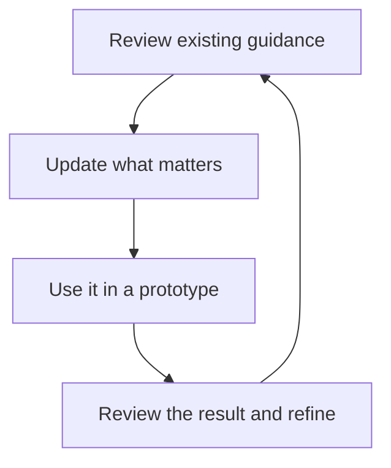

Shared guidance helps your agent make consistent decisions across prototypes. Keep it focused on what your team wants the agent to know or do repeatedly.

## Decide what to save

| What you want to keep | Where it fits |
| --- | --- |
| Who your customers are and what they need | Audience context in your product's system. |
| Principles, brand voice, or design standards | Context in the relevant system. |
| A repeatable task, such as reviewing copy against your standards | A skill in the relevant system. |
| A decision specific to one exploration | A document or note with that prototype. |

You can ask your agent to organize the guidance for you:

> Save these customer insights as context in our Product system. Check the existing audience document first and update it where appropriate.

## Review and refine

Open your system's **Context** and **Skills** to read the current guidance. Ask the agent to revise it, or use **Edit source** to change the document yourself.

When adding guidance, look for an existing document that covers the subject. Keeping related knowledge together makes it easier to review and update. Give a different subject its own document when that makes it clearer.

Save the choices that make the work fit your team. A skill can explain decisions and review the result while Studio's tools handle repeatable file operations and checks. Ask the agent to reuse those tools and keep each workflow focused on the requested outcome. A settings update should not create sample work just to complete a checklist.

## Learn from the work

If a result misses the mark, explain why and ask the agent to review the guidance it used. A useful correction might be:

> Our audience knows the industry but is new to this product. Update the onboarding guidance to reflect that, then revise this flow.

For a team, agree on changes to shared principles and standards together. Keep the guidance current as your understanding of customers and your product grows.
