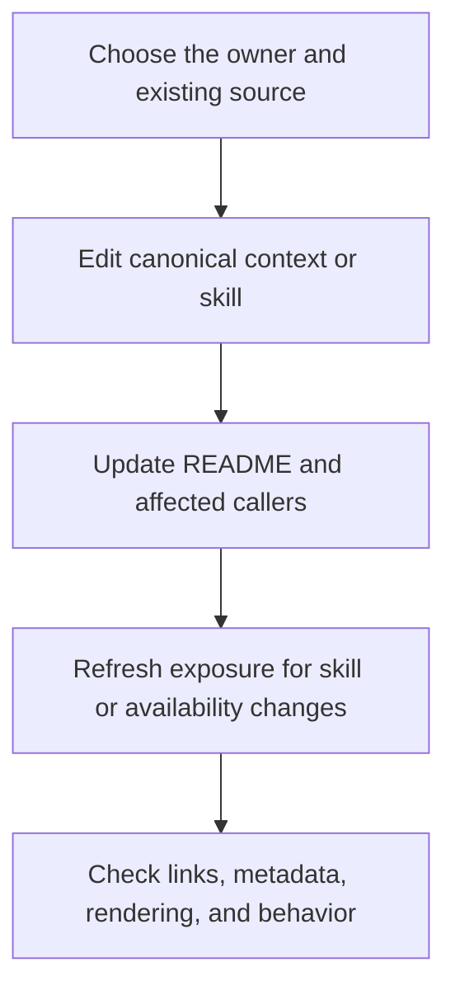

Ask your agent to make changes in the source that owns the guidance. The browser provides reading and source access; generated harness entries point back to those canonical files.

Use **Maintain Context** to author context and task procedures. Use **Maintain Documentation** to revise READMEs, coordinate Guide updates, or audit consistency. **Write Guide** owns Guide chapter edits when Documentation is enabled.

Keep each fact, requirement, or procedure in one authoritative source and link to it from consumers. Split a document when subjects have distinct purposes or readers; avoid adding another note that repeats the same guidance.

## Refresh and verify

After skill or capability-availability changes, ask your agent to run `pnpm studio sync`. It refreshes managed project entries while preserving user-authored files. Development startup also synchronizes. A build validates the sources without rewriting adapters. Refresh the harness or start a new session when its skill list has not updated.

Edit canonical files, not generated `.agents/skills/` entries or `.claude/skills/` links. The plugin's entry skills are maintained with the plugin; a studio's task procedures are maintained in that studio.

For authoring details, use [Documentation standards](/documentation/context/platform.core/context/documentation-standards). To check actual behavior, ask the agent which skill, system, and sources it used, then review its resulting work. The browser inventory and automated checks do not record or prove conversation reads.
