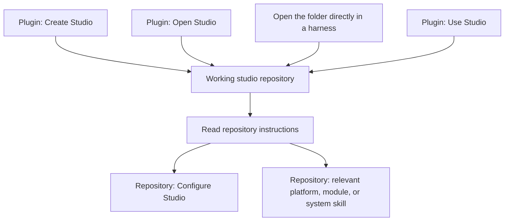

The installed plugin owns three entry skills. They are separate from the repository's operating skills and stay out of the Studio instruction browser.

| Plugin skill | Responsibility |
| --- | --- |
| Create Studio | Get the starter, prepare its dependencies, launch it, and hand off to its working folder. |
| Open Studio | Locate and reopen an existing studio, preserving its work and configuration. |
| Use Studio | Establish the target repository and follow its current task procedures. |

## Create versus configure

**Create Studio** makes the environment available for exploration. **Configure Studio** personalizes an already-running environment: studio identity, contributor registration, design system, and product context. Configuration is a task selected when needed, rather than a prerequisite for every session.

The plugin delegates contributor registration to the repository's procedure instead of maintaining its own copy. **Setup Contributor** also handles someone joining an existing studio. These workflows resume from existing state.

You can work in the repository without the plugin. The plugin's installation and permission requirements are separate from project skill discovery.
