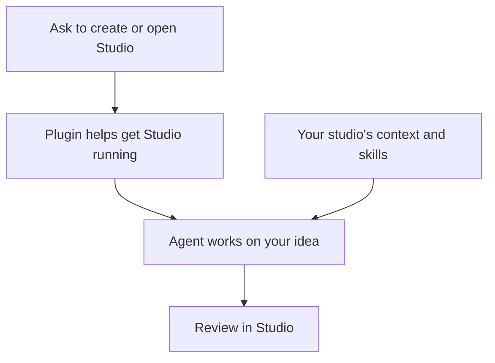

The Design Studio plugin helps your agent get your studio running. Your studio is a folder on your computer containing your prototypes, design systems, and shared guidance.

## Start or return to your studio

Ask your agent in plain language:

| What you want | What to ask |
| --- | --- |
| Start a new studio | “Create a Design Studio for me.” |
| Return to existing work | “Open my Design Studio.” |
| Explore an idea | “Use my studio to prototype a new onboarding flow.” |

The plugin helps the agent create or open the studio. Once you are working there, the agent uses the studio's own guidance to build and refine your ideas.

## Make it your own

Creating a studio gives you a place to start. Configuring it makes that place fit your team: its name, people, design system, and product knowledge.

You can begin exploring, then ask your agent to help personalize the studio. For example:

> Help me set this studio up for our team. We want to use our components and add context about our customers.

If you are joining a team's existing studio, ask your agent to help you join it. See [Set up](/documentation/guide/getting-started) for getting started and [Customize your studio](/documentation/guide/customize) for making it your own.

## Use another coding agent

You can also work with Studio in Claude Code or Cursor. Open your studio's folder in the coding tool you want to use, then ask its agent to help you continue. Your prototypes and shared guidance stay with your studio.
