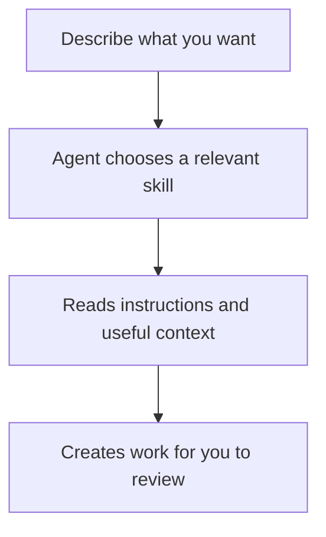

A skill is a set of instructions for a particular task. Studio includes skills for work such as building prototypes, writing documents, and creating diagrams.

Describe the result you want. Your agent can choose the relevant skill; you do not need to know its name.

## From a request to a skill

Suppose you ask:

> Create a diagram showing how a customer goes from choosing a plan to completing payment.

The diagram skill gives the agent instructions for creating that kind of work in Studio. Your product context helps it describe the right experience.

## Understand what guided the result

If you want to understand a result, ask:

> Which guidance did you use, and how did it shape this design?

This can help you decide whether to refine your request, update shared context, or ask for a different approach.

You can read Studio's skills in **Documentation → Context & Skills**. Skills specific to your product or brand are in **Systems**. See [Agent context](/documentation/guide/agent-context) for how skills and context work together.

## After adding a skill

Ask your agent to make a new skill available in your coding tool as part of creating it. If it does not appear in the tool's skill list, try a new chat or ask the agent to check the setup.
