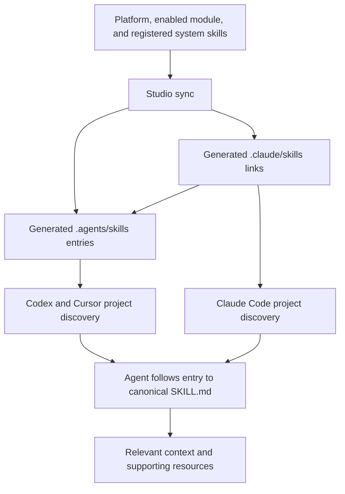

Canonical skills remain under their owners. Synchronization creates small project entries that point back to those procedures. These generated entries contain discovery metadata and routing guidance; they do not own another implementation of the task.

## Available versus read

The intended reading sequence is progressive:

1. The harness exposes skill names and descriptions for selection.
2. The agent reads the selected skill's procedure.
3. The agent follows references needed for that task.

Context documents are not individually registered as skills, and Studio does not inject every context file into every conversation. Root `AGENTS.md` supplies essential requirements and routes. A system's `AGENTS.md`, when present, selects its relevant guidance. Module declarations can add conditional task routes to the root entry point.

The host's discovery behavior still needs verification in the installed harness. Generated files prove that entries exist; they do not prove that a host registered them or that an agent read them. See [Agent context routing](/documentation/context/platform.core/context/agent-context) for the exact exposure and validation contracts.
