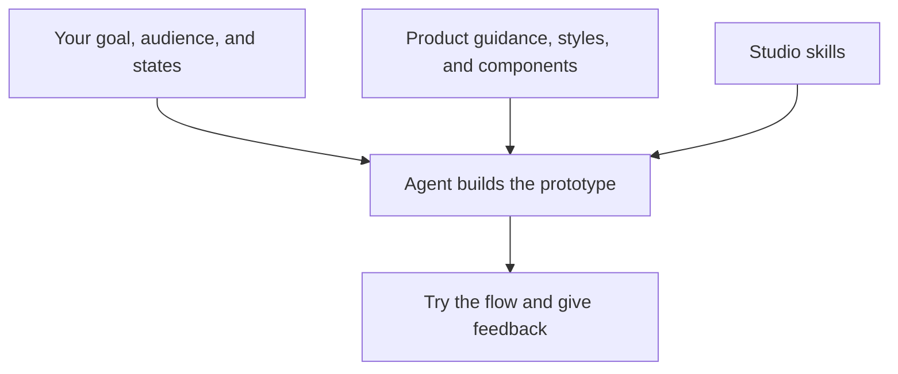

A useful request describes what you want to explore, who it is for, and what matters most. Your agent can combine that direction with the guidance already saved in your studio.

## Start with the outcome

For example:

> Prototype a checkout for first-time customers. Make delivery costs clear before payment. Use our Product system and show both the happy path and a declined-card state.

This gives the agent an audience, a design priority, a system to use, and the states you want to review. You can also point it to research, a reference, or an existing prototype.

## Use the right system

Each prototype can use a system that brings together its components, styles, and product guidance. A marketing exploration may use your Marketing system, while an in-product flow uses your Product system.

Tell the agent which system you want when you create the prototype. For existing work, it should follow the prototype's assigned system. If you are unsure, ask:

> Which system does this prototype use?

Browse the system in **Systems** to review its guidance. To change an existing prototype's system, ask the agent to help with that change.

## Refine through feedback

Try the prototype and describe what should improve:

> The delivery step feels too busy. Keep the cost visible, but simplify the choices and explain the recommended option.

Keep feedback about this exploration in the task. If you discover a principle that should apply across your product, ask the agent to save it as shared context. See [Maintaining guidance](/documentation/guide/agent-maintenance).
