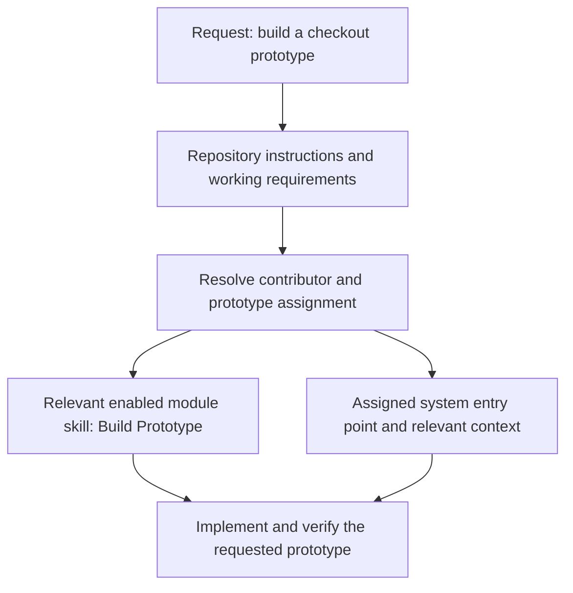

For prototype work, the prototype's assignment selects product guidance. The browser's selected system does not set the assignment or load context into the conversation.

## Assignment selects the system

| Prototype assignment | Product guidance |
| --- | --- |
| An explicit system ID | That registered system. |
| Explicit None (`system: null`) | Local components and styling; no assigned system. |
| Assignment omitted | The configured default system. |

For example, a Marketing prototype uses the Prototypes module's skill alongside Marketing context. Product system guidance does not apply merely because it exists in the repository. A pending rebuild also needs the target system's guidance while preserving the original exploration.

## Other tasks

Other tasks select different sources. Changing Studio's interface uses platform guidance and the Studio system. Adding a brand-writing skill belongs to that brand's system. Platform principles and personas apply to platform product and architecture decisions, not as substitutes for your product's audience.
