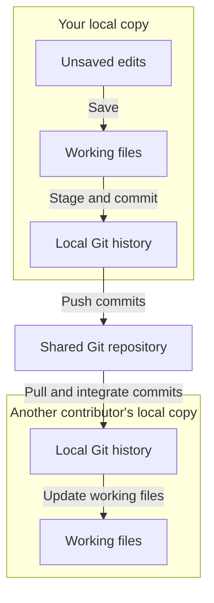

A team shares a repository and systems, including their components and context. Each contributor has their own prototypes. Ask your agent to set up your contributor identity when you join an existing studio.

## Own your experiments

Make changes in your own prototypes. You can inspect other contributors' work and discuss changes with them. For changes outside your scope, ask your agent to prepare a pull request for review.

Prototype-local components and styles give you room to experiment without changing the team's shared system.

## Studio settings and roles

**Studio settings** shows the studio's configuration, installed modules, and contributors. See [Configure the studio](/documentation/guide/customize#configure-the-studio) for how to open it, save changes, and manage optional capabilities.

Contributors manage their own prototypes. System maintainers also manage the active systems assigned to them. Admins manage the whole studio, including other contributors’ prototypes and system availability. Team studios need at least one Admin and can have several. In personal use, your local contributor is automatically an Admin.

Admins assign permissions in the Contributors section. Ask your agent to register or update profiles. Local permissions do not grant repository access. Settings administration is excluded from the published site. See [Studio configuration](/documentation/reference/platform/context/config.md) for file structure and command details.

## Share through Git

Saving changes updates your local files. To share them, ask your agent to review and commit the work, then push it through your team's review process. Other contributors pull those changes into their copies.

A commit records a version in local Git history. Push shares commits; pull receives and integrates them. Conflicts may need resolution. Follow your team's branching and review process.

Tell your agent when to share work. A local save does not publish it or send it to the team.

## Publish for review

Publish a site when people need a viewing link without running Studio. Hosting is optional and separate from sharing code through Git.

Published views remain interactive. The site does not provide live co-editing or an agent service. Archived prototypes stay available locally and are excluded from the published build.

Your maintainer chooses hosting, access, and update timing. Ask your agent to consult [Publishing](/documentation/reference/platform/context/publishing.md) when setting this up.
