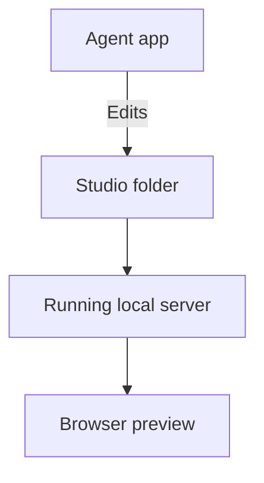

## How do I set it up?

If you are reading this in your local studio, it is already running. For a new installation, choose a path in the [public setup instructions](https://github.com/itspatmorgan/design-studio-starter/blob/main/SETUP.md):

| Path | Where to start |
| --- | --- |
| Codex plugin | A local chat in the Codex desktop app. |
| Claude Code plugin | A local Code session in Claude Desktop. |
| Cursor plugin | A local Agent chat in Cursor. |
| Direct from source | Your local coding agent, without installing a plugin. |

The setup instructions give you the prompt to copy. Your agent handles installation and shows you the studio folder and browser address. With the plugin available, ask **“Create my Design Studio.”**

All paths provide the same working studio. You just need an agent that can work with local files. If you prefer not to use a plugin, the direct-source path is an alternative that provides an identical experience.

## What needs to be open?

Your **agent app** changes files in your **studio folder**. A local server reads those files and provides the **browser preview** where you explore the result.

Continue agent work in the studio folder shown during setup. Opening its browser address alone does not select that folder in your agent app.

Keep the local server running while using Studio. Closing a browser tab does not delete your work. If the server stops, ask your agent to reopen the studio.

## How do I return later?

Open the same studio folder in your agent harness and ask:

> Open my Design Studio and show me the running preview.

If you cannot find it, ask the agent to locate your existing studio before creating another one. Your files remain in that folder between sessions.

A plugin update does not automatically update an existing studio. See [updating a customized studio](/documentation/manual/customize#how-do-i-update-my-studio).

## How do I join a team studio?

Ask a teammate for access to the team's repository, then ask your agent to open a local copy and register you as a contributor. Keep the team's existing systems and settings.

Joining uses the existing studio; creating a new studio gives you a separate environment. See [Personal & team use](/documentation/manual/team) for permissions and sharing changes.

## What if I am viewing an online studio?

A published studio lets you explore interactive work without running the project locally. Creating and editing happen in a local working copy. See [Publishing & Home](/documentation/manual/share) for the distinction.
