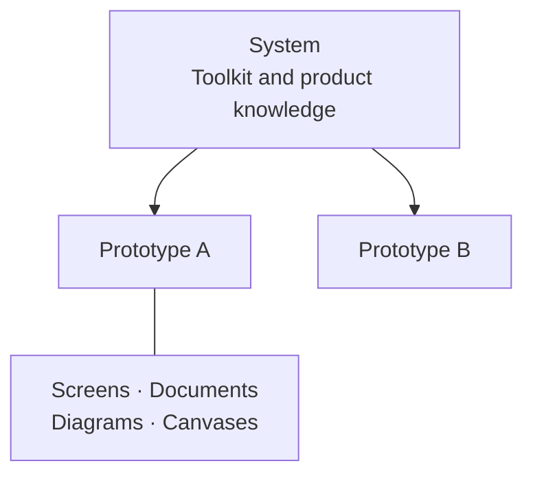

## What is Design Studio?

Design Studio is a prototype sandbox for designers and product managers. Work with your coding agent to turn ideas into interactive experiences, using your components, context, and design principles.

Build the interface, map the flow, and capture your thinking in one connected prototype. Use it to explore an idea, discuss behavior, and give your team something tangible to review.

You direct the work. Your agent builds and refines it. Design Studio gives you a place to try the result and participate directly.

## How is the studio organized?

There are two main collections:

- **Systems** hold reusable components, visual styles, assets, and product knowledge.
- **Prototypes** hold individual explorations: working screens and supporting documents, diagrams, and canvases.

Use the included example systems and prototypes to explore. You can adapt or replace them when you are ready. Documents, Diagrams, and Canvases depend on enabled modules.

## What do I own and customize?

Design Studio is open source. Your studio and its source files live in a folder you control. Screens use React, documents use Markdown, diagrams use Mermaid, and canvases use Excalidraw.

Useful defaults give you a working starting point. Bring in your own design system and product knowledge to make the work feel like yours. Your agent can also change the platform or add modules for your needs.

Design Studio works with coding agents such as Codex, Claude Code, and Cursor. It does not supply its own agent. Continue in the agent environment you already use.

## What is it compatible with?

The intended starting stack is **React, TypeScript, and Tailwind CSS**. The supported starting libraries, shadcn/ui and Untitled UI, use Tailwind and fit this environment.

Your own React components may fit too, depending on their styling and dependencies. Other frameworks, styling approaches, or components tied to application services can require more adaptation. Ask your agent to assess them before importing a system.

This is a **front-end prototyping environment**. It can simulate data and service behavior; it does not provide a production backend. Open source makes further adaptation possible, but the effort depends on your stack and requirements.

## Where should I look next?

| Your question | Page |
| --- | --- |
| How do I install or reopen my studio? | [Working environment](/documentation/manual/environment) |
| How do I direct work and give visual feedback? | [Working with your agent](/documentation/manual/agent) |
| What belongs where, and how do I use my system? | [Prototypes & systems](/documentation/manual/prototypes) |
| How do teammates join and share work? | [Personal & team use](/documentation/manual/team) |
| How do I publish, and what appears on Home? | [Publishing & Home](/documentation/manual/share) |
| How do I change settings or add capabilities? | [Modules & customization](/documentation/manual/customize) |
| Something is missing or not working. | [Help](/documentation/manual/questions) |

Use this Manual when a question comes up. **Documentation → Context & Skills** contains detailed platform and module documentation, including the instructions your agent uses. Product-specific guidance lives in **Systems**.
