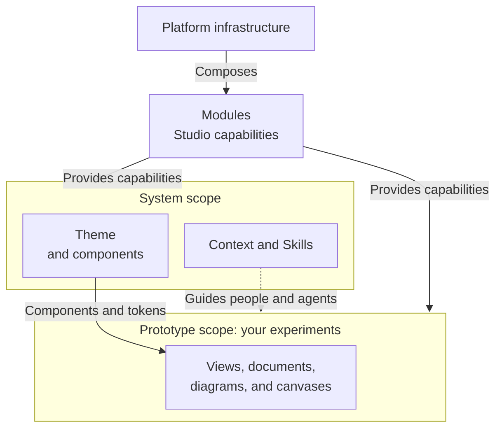
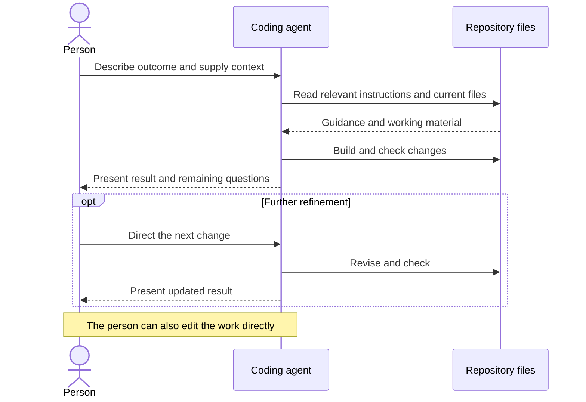

Design Studio brings your prototypes, design system, and team context into one workspace. You own its files and the work you create. Use it on your own or with a team.

You do not need to understand the whole platform to begin. Start with the sample prototype, then ask your coding agent to help create your own.

## Your work and shared capabilities

Your prototypes are independent working areas. Systems and platform capabilities support the whole studio. Coordinate changes to these shared capabilities with your team.

These boundaries describe collaboration scope. Your contributor area is the default place for independent work. Modules provide capabilities; system knowledge guides people and agents rather than creating a code dependency. Documents, diagrams, and canvases are optional capabilities.

## Working with your agent

Open the same repository in your coding agent and run Studio alongside it. Describe what you want to explore. The agent changes files; Studio lets you see and interact with the result.

This shows one iteration. Checks can fail, and the agent may need clarification before it builds.

The [Agents section](/documentation/guide/agent-context) explains how to give your agent useful direction and shared knowledge, then refine both through your work.

Give the agent your goals, constraints, and feedback. You can work visually while it handles code and technical details.

## Find your way around

| Surface | What you do there |
| --- | --- |
| [Home](/documentation/guide/home) | Find work and search the studio. |
| [Prototypes](/documentation/guide/prototypes) | Explore ideas using screens, writing, diagrams, and canvases. |
| [Systems](/documentation/guide/systems) | Browse components, styles, context and skills for your prototypes. |
| [Documentation](/documentation/guide/documentation) | Read this Guide or browse Context and Skills. |

Run Studio locally to make changes. You can also publish a viewing site when you want to share your work.

## Make the studio your own

Start with prototypes, then configure the studio, add systems, or build modules. [Customize your studio](/documentation/guide/customize) explains these scopes and the responsibility for future updates.
