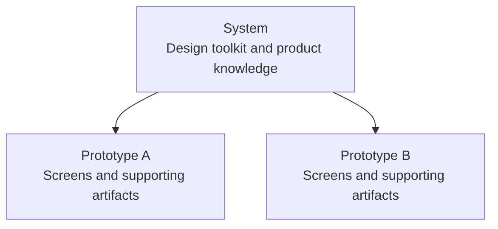

Design Studio is a workspace for designing with your coding agent. Describe what you want to explore, let the agent build it, and use Design Studio to try the result and guide the next change. You own the files and can work alone or with a team.

## Two big ideas: prototypes and systems

**Prototypes** hold your explorations: working screens and the notes, diagrams, and canvases that explain an idea. **Systems** hold your shared foundation: reusable components, visual styles, assets, and product knowledge.

You can experiment inside a prototype without changing the shared system. Changes to a system can affect all prototypes using it.

## Working with your agent

Work with your agent directly in Design Studio's folder on your machine. Give it your goals, references, constraints, and feedback. The agent handles implementation and checks; you direct the work and judge the result.

Design Studio does not provide its own agent. It provides a workspace for the agents you already use. It also provides manual controls for human users to take action directly when it makes sense.

If you are viewing a studio online, you can only explore its work. Creating and editing happen locally on your computer.

## What do you need to know?

| Subject | Look here |
| --- | --- |
| Screens, documents, diagrams, and canvases | [Prototypes](/documentation/guide/prototypes) |
| Your design toolkit and product knowledge | [Systems](/documentation/guide/systems) |
| Settings, team access, and new capabilities | [Customize](/documentation/guide/customize) |
| Viewing links, shared files, and engineering handoff | [Share](/documentation/guide/share) |
| Missing tools, editing, reopening, and problems | [Help](/documentation/guide/questions) |

Use this Manual as a reference when a question comes up. **Documentation → Context & Skills** contains the detailed instructions your agent uses. Product-specific guidance lives in **Systems**.
