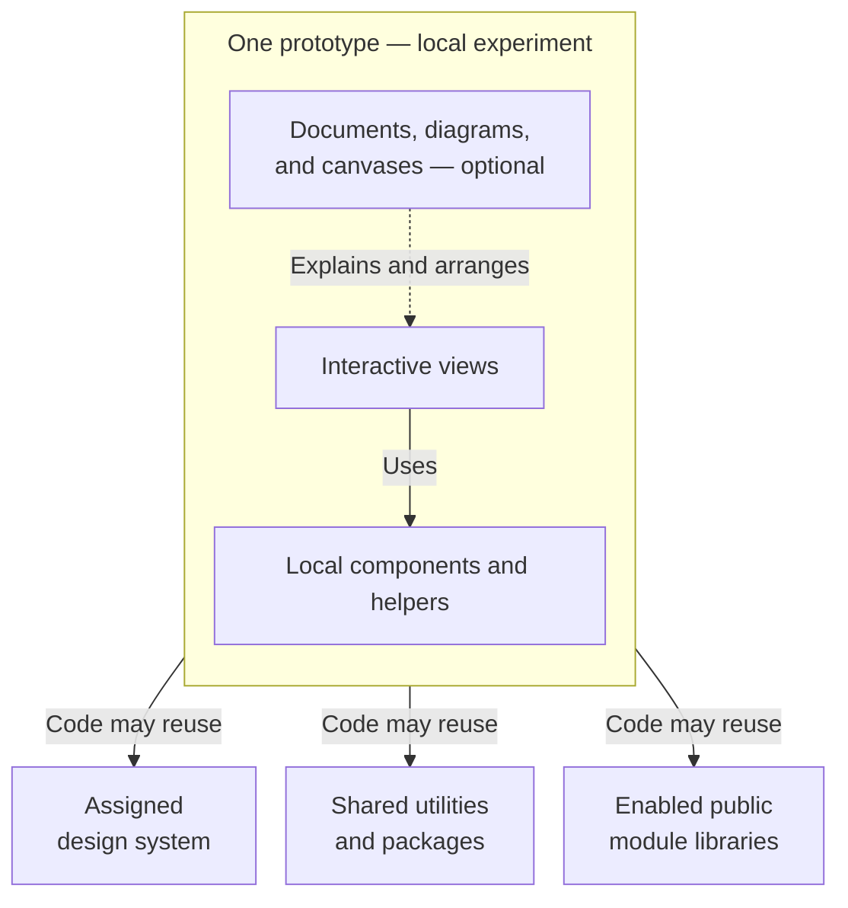

A prototype is a workspace for an idea. It brings interactive screens and supporting context together, without affecting other prototypes.

Ask your agent to create one, or select **New prototype**. Give it a goal, then iterate with your agent as you review the result.

The creation dialog asks for a title and system. Choose an installed system for its components, styles, and guidance. Choose **No system — custom styling** to build with your own components and CSS instead.

The sidebar shows the prototype's assigned system beneath its title. Select the system name to browse its components and guidance. A prototype without an assigned system shows **None**.

The Prototypes page supports links filtered to a system. A visible system filter identifies the collection; search works within it. Select **Clear system filter** to return to all systems.

## Artifacts work together

A prototype's pieces of work are **artifacts**. Each artifact is backed by a file.

| Artifact | Use it for |
| --- | --- |
| View | An interactive screen or state. |
| Document | Goals, decisions, research, or a handoff. |
| Diagram | A portable, text-based model of a flow or system. |
| Canvas | Views, diagrams, and notes arranged together. |

Documents can embed views, diagrams, and canvas previews. Canvases can embed views and diagrams, and link to documents. Use these together to explain both an idea and how it works.

Views are always available. Documents, diagrams, and canvases are optional capabilities included in the starter.

## Organize the exploration

Add artifacts with **+** in navigation. Enter a name. Studio supplies the file extension. Use folders to group work, and drag items to move or reorder them. The first artifact in navigation is where the prototype opens. Reordering keeps your current artifact open. A brief message confirms when a move updates references.

The Feedback Inbox sample demonstrates an introduction, early exploration, app screens, and individual states. Your prototype can use whatever organization suits the work.

Right-click a view and choose **Make lofi** to explore in grayscale with handwritten type. **Make hi-fi** restores its normal appearance.

## Make changes safely

When you rename or move files inside a prototype, Studio repairs known links, embeds, and local code imports automatically. Keep Studio running when moving files in Finder or your editor so it can follow the move. Other prototypes remain unchanged. If a target was deleted, a move happened while Studio was closed, or a link was built dynamically in code, ask your agent to repair it.

Your assigned design system supplies components and styles. You can also explore local alternatives inside the prototype. Those experiments stay separate from the shared system.

Your code can reuse the assigned system, independent shared utilities, installed packages, and public libraries from enabled modules. Other prototypes, other systems, and private platform code stay outside its dependencies. A prototype with no assigned system uses local components and styles. Moving a local component into a shared system is a coordinated change.

Edit your own artifacts with your agent or the [shared source workflow](/documentation/guide/home#working-with-files). Other contributors' source opens read-only.

Use the prototype's **…** menu to **Rename**, **Duplicate**, or archive it. Archiving keeps it locally and excludes it from the published site. Put project context in a document artifact.

## Explore another system

The assigned system stays with the prototype in the app. To try another system, choose **Duplicate** from your own prototype's menu. Give the copy a title and choose a system, including **No system — custom styling**.

Keeping the same system creates an ordinary copy. Choosing another system asks you to confirm a rebuild copy. Systems rarely translate directly; components, styles, and some behavior may need to be reconstructed. The original stays unchanged so you can compare the result.

A rebuild copy keeps its current system until your agent migrates it. Its sidebar shows **Rebuild needed** and the target. Select **Copy rebuild instructions** and paste them into your coding agent. Creating the copy does not start an agent or convert its code automatically. The agent updates the assignment and clears the notice after verifying the rebuild.
