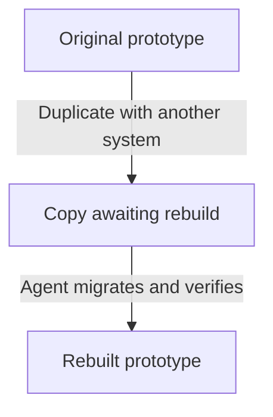

## What belongs in a prototype?

A prototype holds one exploration. Its pieces are called **artifacts**. Use the ones that help explain your idea.

| Artifact | Purpose | How it connects |
| --- | --- | --- |
| View | A working screen or state. | Open it to try the interaction. |
| Document | A brief, notes, decisions, or handoff. | Can link to artifacts and show their previews. |
| Diagram | A flow or relationship. | Can also appear in a document or canvas. |
| Canvas | Sketches, annotations, and comparisons. | Shows screen and diagram previews, with cards for documents. |

Views are always available. Documents, Diagrams, and Canvases are optional capabilities. Disabling one preserves its files but hides it from normal navigation.

## How do I create one?

Ask your agent to create a prototype, describing its goal and system. Or select **New prototype**, enter a title, and choose a system. This creates starting files; it does not start an agent or build your intended experience.

The assigned system appears beneath the prototype title. Browsing another system does not change the assignment. **No system — custom styling** uses local components and styles instead.

## How do I organize artifacts?

Use **+** in navigation to add artifacts or folders. Drag items to move or reorder them. The first artifact is where the prototype opens on the next visit.

Right-click an item for file actions. Studio repairs known links and embeds when files move within a prototype. Keep Studio running during moves in your editor or Finder. Moves while Studio is closed, deleted targets, and dynamically built links may need your agent to repair them.

Use the prototype's **…** menu to rename, duplicate, or archive it. Archiving keeps it locally and excludes it from publication. For source editing, see [Help](/documentation/guide/questions#how-do-i-edit-source).

## How do documents and diagrams work?

Ask your agent to write or revise them, or edit their source. Documents use Markdown; diagrams use Mermaid, a text format for flows and relationships. You can direct both in plain language.

Documents can show previews of artifacts from the same prototype. Open the original to interact or edit. Mermaid diagrams can also live directly inside a document without the standalone Diagrams capability.

If a diagram displays a syntax error, give the message to your agent. Documents and diagrams use Studio's reading style rather than the prototype's system theme.

## How do canvases work?

Use the Excalidraw toolbar for shapes, text, and arrows. Press **N** for a sticky note. Drag an artifact from navigation onto the canvas, or copy its link and paste over the canvas.

View and diagram previews update with their source. Open the original to interact. Documents and other canvases appear as link cards. Annotations do not automatically change the screens.

Canvases embed only artifacts from their own prototype and cannot store images. Changes save automatically locally. Other contributors' and published canvases are read-only. Agent file edits may not become separate undo steps.

Importing Mermaid through **More tools → Mermaid to Excalidraw** creates independent editable shapes; they do not stay synchronized with the diagram.

## Can I try another appearance or system?

Right-click a view and choose **Make lofi** for grayscale and handwritten type. **Make hi-fi** restores its normal appearance.

To try another system, choose **Duplicate** and select the target system. A different system creates a rebuild copy, preserving the original. The copy keeps its current system until your agent migrates it.

Use **Copy rebuild instructions** in the copy's sidebar and paste them into your agent. Creating the copy does not convert its code automatically.
