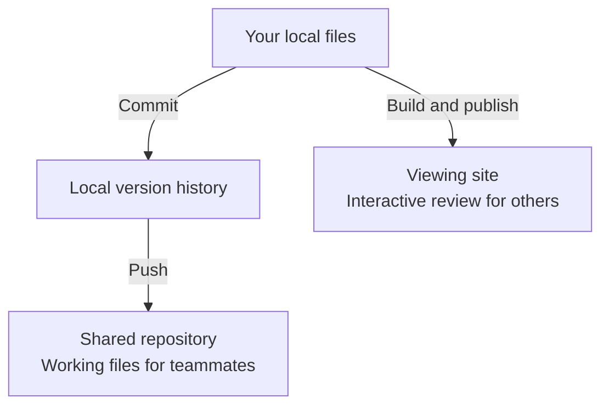

## Does saving share my work?

No. Saving updates local files. A commit records a version locally. Pushing sends committed versions to a shared repository. Publishing creates or updates a viewing site.

Your agent can handle these steps. Tell it when you want to share and follow your team's review process. Neither path creates live co-editing.

## How do I share a viewing link?

Ask your agent to help publish, specifying the destination and audience. Published screens remain interactive; source and canvas editing stay local. Updates appear after another publication.

The build can include active prototypes, system pages, product context, and the Manual. Review what is included. Studio has no built-in sign-in; restricted access depends on the host. Archived prototypes remain local and are excluded from publication.

Copy links from the published site for remote reviewers. A localhost link points to a server on the viewer's own computer. Your agent can consult [Publishing](/documentation/context/platform.core/context/publishing).

## How do teammates get my working files?

Ask your agent to review and commit changes, then share through your team's Git workflow. Teammates pull those changes into their copies. Repository access and conflict resolution are separate from Studio's contributor assignments.

## What should reviewers or engineers receive?

Provide a starting point, the question you want feedback on, and an explanation of the intended behavior. Identify sample data, simulated actions, and unresolved decisions.

For engineering handoff, also include relevant states, design intent, constraints, and the system components used. Give access to working files when the recipient needs to inspect code. Documents and canvases can hold explanations when those capabilities are enabled.

A prototype informs production implementation. Ask the engineer what else they need to assess application services and production requirements.
