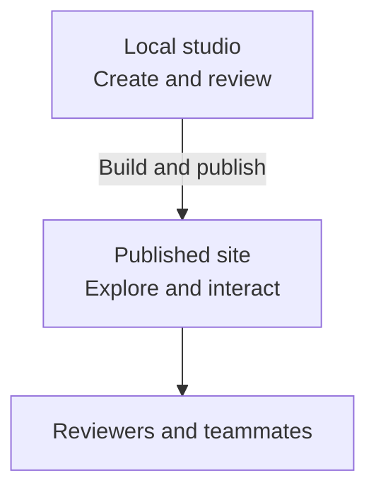

## What is the difference between building and publishing?

Your local studio is the working environment. A published studio is a viewing site made from those files.

| Local studio | Published site |
| --- | --- |
| Create, edit, and organize working files. | Explore the published work and interact with screens. |
| See saved changes during development. | See updates after another publication. |
| Work with your coding agent. | No shared editing backend or agent service. |

Saving does not publish. Sharing working files through Git is a [separate team workflow](/documentation/manual/team#how-do-we-share-changes).

## How do I publish?

Design Studio produces a static website that many hosting services can serve. The right choice depends on your company's policies, available accounts, and who needs access. Hosting usually needs configuration outside Studio.

Two paths have specific support:

| Path | What you need |
| --- | --- |
| ChatGPT Sites through Codex | The Design Studio plugin and an available, connected Sites integration. Ask your agent to publish your studio through Sites. |
| GitHub Pages | Your studio in a GitHub repository, with access to configure Pages and its deployment workflow. Your agent can help set this up. |

Having a GitHub repository does not automatically publish your studio. Copies of the starter need their own deployment configuration.

For other hosts, ask your agent to assess what is needed with whoever manages hosting for your team. The agent can help prepare the build and configuration. What it can complete depends on its tools and your access. See [Publishing](/documentation/context/platform.core/context/publishing) for technical requirements.

After publishing, verify the site and copy links from it. A **localhost** link points to the viewer's own computer and will not share your local studio with remote reviewers.

Local edits do not appear online automatically. Publish another build through your configured hosting workflow to update the site. Teams can configure publication after changes merge into main; see the [branch and pull-request workflow](/documentation/manual/team#how-do-we-share-changes).

## What becomes visible?

The build can include active prototypes, system pages and context, and the Manual when enabled. Review sample data, documents, and shared guidance before publishing.

Archived prototypes and systems are excluded. Disabling an artifact module hides that capability. Home is a selection of links, not a control over what the build includes.

Studio has no built-in sign-in. Restricted access depends on the hosting service. Contributor permissions do not restrict published viewers.

## What does Home show?

Select the Design Studio logo to return to **Home**. It offers search and links supplied by enabled modules.

Locally, Home greets you and puts your prototypes first, alongside recent team work and systems. On the published site, it shows the studio name, optional tagline, and links to available work without identifying the viewer.

An item missing from Home may still be available in its collection or through search.

## How do I customize Home?

Use **Studio settings → General** to change the studio name and tagline. The tagline appears on published Home after you publish the update.

Home's sections follow enabled modules and available content. There is no separate Home layout editor or featured-item setting. Ask your agent to change the code or add a module if you want a different introduction, arrangement, or selection of work.

## How do I share with reviewers and engineers?

Share a published prototype link when people want to explore the experience and give feedback.

Engineers who want to inspect the code can pull your team's Design Studio repository into a local copy, then open the relevant prototype in its contributor folder. They need access to that repository.

Prototype source is stored in plain-text files: React code, Markdown documents, Mermaid diagrams, and canvas data. Engineers and their agents can read the work directly, including its supporting context.

Agree with your engineers on any additional materials they need for handoff. Design Studio provides the working files and a viewing experience; your team decides how to use them.
