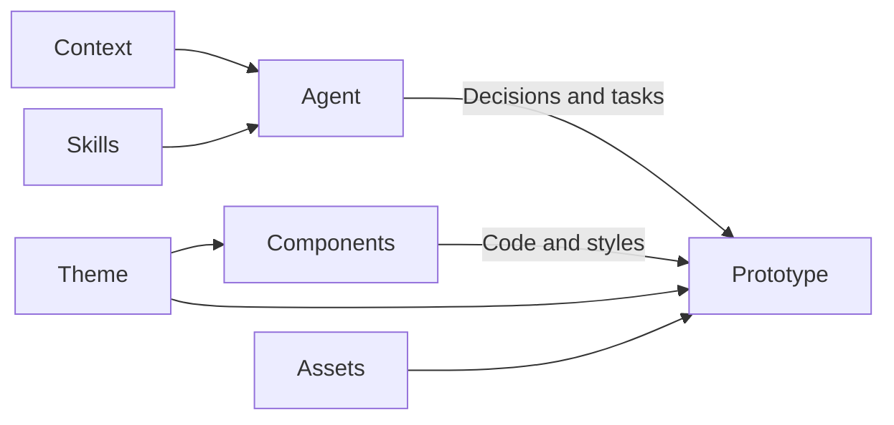

Systems brings together the components, styles, and knowledge used by your prototypes. Open Systems to see your systems as cards or a list. Search by name or description. A **Default** badge identifies the system used for new prototypes unless you choose another. Each prototype system shows how many active prototypes use it. Studio is the system used for Design Studio’s interface and is maintained by the platform. Open a system to browse Context, Skills, Theme, Assets, and Components. Click Systems in the main navigation to return to the collection.

The Resources toolbar searches across the tree and expands or collapses all folders. Search reveals matches without losing your previous expansion choices. Context, Skills, Theme, Assets, and Components start open. Guidance appears above the toolkit, and each guidance group has its own **New** action.

Overview summarizes the selected system’s instructions, components, theme, and local assets. Counts show what is included; navigation provides the full inventory. The usage section shows active prototypes, previews up to three recent examples, and links to the complete filtered collection. Studio explains its application role instead. Product and Marketing are starter kits to replace with your team’s systems.

The menu beside the system name lets you copy its overview link or, locally, open its folder in your editor or Finder. Admins can rename prototype systems without changing their links, or choose **Set as default** for future prototypes. Existing prototypes keep their current systems. **Remove system** checks dependencies before allowing removal: choose another default and resolve any prototype assignments or other references first. Removed systems are saved in Studio trash; use **Removed systems** on the Systems index to restore one. Studio’s identity and availability are maintained by the platform.

## Prototype systems and Studio

**Product** is the starter toolkit for prototype views. Replace or adapt it to match your product. You can add more systems when different work needs a different toolkit.

**Marketing** demonstrates a second starter toolkit, using a small Untitled UI subset. Replace it with the system relevant to your team’s public-facing work. The Design Studio Marketing prototype uses its own palette, typography, and components alongside Product.

**Studio** supplies Studio's own interface: navigation, menus, editors, and documentation. It stays separate from prototype design systems.

Each prototype uses an assigned system and can also have local components and styles.

## How a system supports the work

Your system has five parts: Theme, Components, Assets, Context, and Skills. Context explains the people, domain, intent, and standing requirements. Skills provide procedures for specific tasks. Theme, components, and assets provide the interface toolkit.

A prototype’s assigned system connects it to that toolkit and guidance. Its code imports components and uses the system’s styles. Agents follow the system’s linked instructions; selecting a system does not automatically load every resource into a conversation.

The Studio system follows the same pattern for the application itself: its toolkit supplies Studio’s interface, and its guidance establishes application design and writing conventions.

## Explore the toolkit

Theme shows the colors, typography, radius, shadows, spacing, motion, and effects declared in the system’s theme file. Component pages show examples, source, and available properties. These help you and your agent understand what you can use.

A system declares whether it supports light mode, dark mode, or both. Systems with one mode keep that appearance in their pages, prototype views, and embeds while Studio follows its global toggle.

## Bring your own system

In your local studio, an Admin can click **New system** on the Systems index and give it a name. This creates a scaffold with a starting theme and preserves the current default and existing prototypes. Its overview offers two copyable prompts: **Curate a toolkit** or **Bring my product system**. Paste one into your coding agent’s chat to continue setup. In personal use, your registered contributor is the Admin.

You can keep the starter while exploring, adapt it, or create a separate system. Removing sample systems and prototypes is your choice.

Start with what you want to make. For example: “Help me curate a system for a customer feedback dashboard.” Your agent can identify the small set of components and theme choices needed for that first prototype. You can also name the components and visual choices directly. shadcn is the primary library starting point; Untitled UI is another source when it suits the work.

If you have an existing React product, ask: “Assess how we can bring our components and theme into this studio.” Share accessible source code or a package. Your agent checks component APIs, theme, fonts, assets, and dependencies before proposing an import. Application dependencies may require help from your engineer. Any changes to fidelity should be explicit.

You do not need to write product context or install additional skills before starting. Add your team's knowledge when you have it, and choose skills for specific recurring tasks.

### System assets

Fonts, custom icons, logos, and images shared by your product belong to its system. Your agent can place local files in that system's `assets/` folder or connect an asset package. An image used by only one prototype can stay with that prototype.

Under Assets, open Fonts, Icons, or Images. Icons also shows the system’s configured icon library. Select a local file to preview it. Empty pages show what you can add. Ask your agent to bring in your files and connect them to your theme or components. Package fonts remain package dependencies; they are not listed as local files. Supplying actual fonts and icons helps preserve your product's appearance.

System files are shared team content. Coordinate changes with your maintainer. Admins can choose an installed default system in [Studio settings](/documentation/guide/customize#configure-the-studio). Saving there, or asking your agent to use the studio configuration command, preserves existing prototypes' system choices, including None. Direct configuration edits do not provide that protection.

Theme pages are generated from its theme file; component pages combine documentation, examples, and component source. Source is available through navigation, using the [shared file workflow](/documentation/guide/home#working-with-files). Component pages offer separate source tabs for documentation, examples, and component code.

## Context and skills

Each system can also hold product knowledge, standing constraints, and task procedures. These are ordinary files beside its components and styles.

| Part | What belongs there |
| --- | --- |
| Context | Personas, principles, research, and shared knowledge. |
| Skills | Procedures for specific tasks. |

Expand a folder to read, add, or edit its files. Other folders stay available as you browse. Empty sections are fine; add material when it improves the work. Give your agent supplied context and ask it to connect relevant files to the system's instructions.

Each skill appears once in navigation and opens its instructions. In source mode, use the file picker to browse its `SKILL.md` and supporting files. Rename or delete a skill through its navigation menu to act on the whole skill, including its supporting files.

A prototype uses its assigned system's knowledge along with platform working context and its own local intent. Files being visible here does not automatically load them into an agent conversation. The [Task context chapter](/documentation/guide/agent-task-context) diagrams how the agent chooses instructions.

Use Documentation’s Context & Skills browser for platform and module knowledge. Use the selected system’s Context and Skills for product and design guidance. Keep your product context in its product system. System knowledge follows Studio's appearance; UI examples follow the system's supported color modes.
