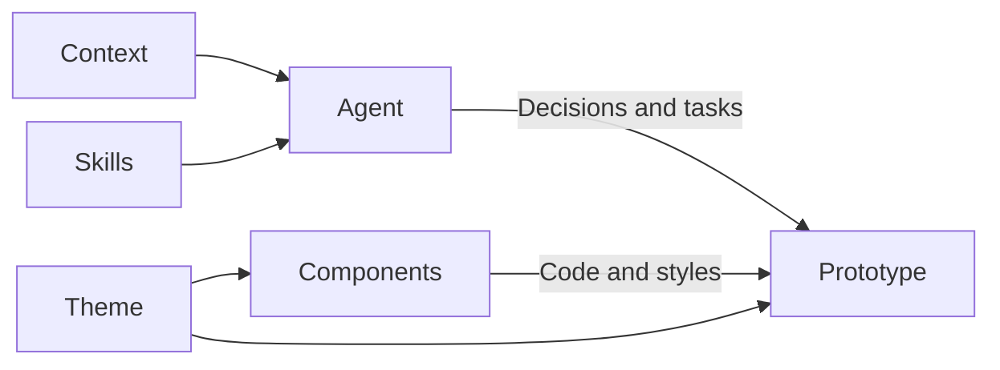

Systems brings together the components, styles, and knowledge used by your prototypes. Use the selector to switch between systems. One navigation tree shows the selected system’s theme, components, context and skills.

The Resources toolbar searches across the tree and expands or collapses all folders. Search reveals matches without losing your previous expansion choices. Context, Skills, Theme, and Components start open. Guidance appears above the toolkit, and each guidance group has its own **New** action.

Overview summarizes the selected system’s instructions, components, and theme. Counts show what is included; navigation provides the full inventory. The usage section shows active prototypes, previews up to three recent examples, and links to the complete filtered collection. Studio explains its application role instead. Product and Marketing are starter kits to replace with your team’s systems.

## Prototype systems and Studio

**Product** is the starter toolkit for prototype views. Replace or adapt it to match your product. You can add more systems when different work needs a different toolkit.

**Marketing** demonstrates a second starter toolkit, using a small Untitled UI subset. Replace it with the system relevant to your team’s public-facing work. The Design Studio Marketing prototype uses its own palette, typography, and components alongside Product.

**Studio** supplies Studio's own interface: navigation, menus, editors, and documentation. It stays separate from prototype design systems.

Each prototype uses an assigned system and can also have local components and styles.

## How a system supports the work

Context explains the people, domain, intent, and standing requirements. Skills provide procedures for specific tasks. Together, they guide an agent’s decisions and work. Theme and components provide the interface toolkit used by the code.

A prototype’s assigned system connects it to that toolkit and guidance. Its code imports components and uses the system’s styles. Agents follow the system’s linked instructions; selecting a system does not automatically load every resource into a conversation.

The Studio system follows the same pattern for the application itself: its toolkit supplies Studio’s interface, and its guidance establishes application design and writing conventions.

## Explore the toolkit

Theme shows the colors, typography, radius, shadows, spacing, motion, and effects declared in the system’s theme file. Component pages show examples, source, and available properties. These help you and your agent understand what you can use.

A system declares whether it supports light mode, dark mode, or both. Systems with one mode keep that appearance in their pages, prototype views, and embeds while Studio follows its global toggle.

## Bring your own system

Ask your agent to import your components, tokens, fonts, and supported color modes. You can keep the starter while exploring and replace it later.

System files are shared team content. Coordinate changes with your maintainer. Admins can choose an installed default system in [Studio settings](/documentation/guide/customize#configure-the-studio). Saving there, or asking your agent to use the studio configuration command, preserves existing prototypes' system choices, including None. Direct configuration edits do not provide that protection.

Theme pages are generated from its theme file; component pages combine documentation, examples, and component source. Source is available through navigation, using the [shared file workflow](/documentation/guide/home#working-with-files). Component pages offer separate source tabs for documentation, examples, and component code.

## Context and skills

Each system can also hold product knowledge, standing constraints, and task procedures. These are ordinary files beside its components and styles.

| Part | What belongs there |
| --- | --- |
| Context | Personas, principles, research, and shared knowledge. |
| Skills | Procedures for specific tasks. |

Expand a folder to read, add, or edit its files. Other folders stay available as you browse. Empty sections are fine; add material when it improves the work. Give your agent supplied context and ask it to connect relevant files to the system's instructions.

Each skill appears once in navigation and opens its instructions. In source mode, use the file picker to browse its `SKILL.md` and supporting files. Rename or delete a skill through its navigation menu to act on the whole skill, including its supporting files.

A prototype uses its assigned system's knowledge along with platform working context and its own local intent. Files being visible here does not automatically load them into an agent conversation. The [Agent context chapter](/documentation/guide/agent-context) diagrams how the agent chooses instructions.

Platform and module knowledge is available through the Platform context and skills link in Systems. Keep your product context in its product system. System knowledge follows Studio's appearance; UI examples follow the system's supported color modes.
