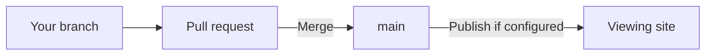

## What changes in team use?

New studios start in **Personal** mode. Your registered local contributor has Admin access, so you can manage the whole environment.

Switch **Studio settings → Studio use** to **Team** when you want contributor permissions. This enables Contributors & Permissions when installed. Ask your agent to install it if missing. Team studios require the module and at least one Admin.

Team mode organizes responsibility. It does not create a hosted editing service or live co-editing.

## Who can change what?

| Responsibility | Direct editing and management |
| --- | --- |
| Contributor | Their own prototypes. |
| System maintainer | Contributor access plus editing and renaming assigned active systems. |
| Admin | Shared settings, permissions, all prototypes, and system creation, defaults, archiving, restoration, and deletion. |

System maintainer is an assignment for a particular system, not a separate studio-wide role. Admins can manage systems without individual assignments.

Open **Contributors** locally to review people and assignments. Contributors can inspect the roster; Admins assign permissions. Archived systems must be restored before editing.

These permissions guide Studio and repository workflows. They do not authenticate people, grant GitHub access, or control who can view a published site.

## How does a teammate join?

Give them access to the team's repository through your Git host. Ask their agent to obtain a local copy, register their contributor identity, and open the existing studio. An Admin can then assign any additional permissions.

Each person works in their own local copy. Joining should preserve the team's systems, configuration, and existing work. See [Working environment](/documentation/manual/environment#how-do-i-join-a-team-studio).

## How do we share changes?

For a team using GitHub, we recommend protecting **main**, the shared branch, and requiring pull requests instead of direct pushes. Your repository owner configures this on GitHub, including required checks and reviews. Studio does not turn these settings on automatically.

Your agent can handle the Git work:

1. **Work on a branch.** A branch keeps your changes separate from main. The agent saves files, commits versions, and pushes the branch to GitHub.
2. **Open a pull request.** This proposes bringing your branch into main. Ask the agent to summarize the changes and check results when you are ready to share them for review.
3. **Review at your own pace.** Leave the request open, or mark it as a draft, while discussing the work. Merge it yourself when ready, or enable [GitHub auto-merge](https://docs.github.com/en/pull-requests/how-tos/merge-and-close-pull-requests/automatically-merging-a-pull-request) if your repository supports it. Auto-merge waits for required checks and reviews.
4. **Merge and update.** Merging brings the work into main. Teammates pull the changes into their local copies. If publishing is configured to run after a merge, the site updates when deployment succeeds. Otherwise, publishing is a separate step.

Saving alone updates your local files. A commit records a local version; pushing shares it through GitHub. Neither necessarily publishes the site.

## How do contributor scopes fit this workflow?

In team mode, Studio associates prototypes with contributor folders and checks changes against ownership, system assignments, and Admin access. The supplied GitHub workflow also checks assets and runs the build.

Pull requests can propose changes outside someone's direct editing scope. Scope checks flag those changes for the appropriate maintainer to review. Passing checks does not replace that review; GitHub's required checks and review rules enforce your team's merge policy.

Let teammates know before changing shared systems their prototypes use. If two branches change the same files, ask the agent to reconcile the conflict before merging. See [Checks and fixes](/documentation/context/platform.core/context/checks) for technical details.

## How do we include reviewers or engineers?

Publish a viewing link for people who only need to explore the work. Give working-file access when someone needs to inspect or develop the code.

Include intended behavior, simulated actions, and unresolved decisions in a handoff. See [Publishing & Home](/documentation/manual/share#what-should-reviewers-or-engineers-receive).
