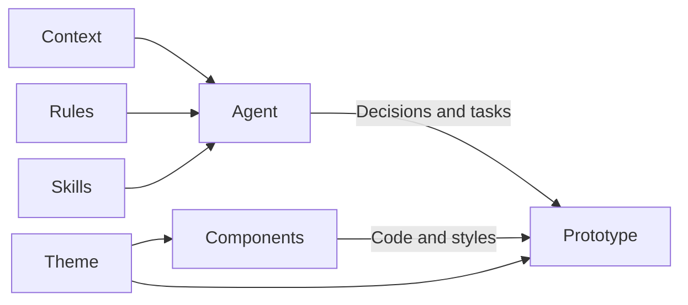

# Systems

Systems brings together the components, styles, and knowledge used by your prototypes. Use the selector to switch between systems. One navigation tree shows the selected system’s theme, components, context, rules, and skills.

The Resources toolbar searches across the tree and expands or collapses all folders. Search reveals matches without losing your previous expansion choices. Context, Rules, Skills, Theme, and Components start open. Guidance appears above the toolkit, and each guidance group has its own **New** action.

Overview shows the selected system’s purpose and two authored summaries: the Instructions section describes Context, Rules, and Skills; Code describes Theme and Components. Each section leads with large inventory counts, followed by its description. Counts come from the system’s files, while navigation holds the full inventory. It also shows the number of active prototypes using the system, previews up to three newest prototypes, and links to the full Prototypes collection filtered to that system. Studio’s overview explains its role in the application instead. Product and Marketing display a starter notice near the top, prompting teams to replace them with their own design systems. Instructions, Code, and usage appear in separate full-width modules stacked in that order. Each follows the same reading order: heading, aligned metrics, then description or prototype links. Optional additional system content appears directly on the page.

## Prototype systems and Studio

**Product** is the starter toolkit for prototype views. Replace or adapt it to match your product. You can add more systems when different work needs a different toolkit.

**Marketing** demonstrates a second starter toolkit, using a small Untitled UI subset. Replace it with the system relevant to your team’s public-facing work. The Design Studio Marketing prototype uses its own palette, typography, and components alongside Product.

**Studio** supplies Studio's own interface: navigation, menus, editors, and documentation. It stays separate from prototype design systems.

Each prototype uses an assigned system and can also have local components and styles.

## How a system supports the work

Context explains the people, domain, and intent. Rules set standing constraints. Skills provide procedures for specific tasks. Together, they guide an agent’s decisions and work. Theme and components provide the interface toolkit used by the code.

A prototype’s assigned system connects it to that toolkit and guidance. Its code imports components and uses the system’s styles. Agents follow the system’s linked instructions; selecting a system does not automatically load every resource into a conversation.

The Studio system follows the same pattern for the application itself: its toolkit supplies Studio’s interface, and its guidance helps agents operate and maintain the platform.

## Explore the toolkit

Theme shows the colors, typography, radius, shadows, spacing, motion, and effects declared in the system’s theme file. Component pages show examples, source, and available properties. These help you and your agent understand what you can use.

A system declares whether it supports light mode, dark mode, or both. Systems with one mode keep that appearance in their pages, prototype views, and embeds while Studio follows its global toggle.

## Bring your own system

Ask your agent to import your components, tokens, fonts, and supported color modes. You can keep the starter while exploring and replace it later.

System files are shared team content. Coordinate changes with your maintainer. The studio configuration command records omitted assignments before changing the default, preserving existing choices. Direct configuration edits do not perform that step. Explicit system and None assignments remain unchanged.

Foundations are generated from its theme file; component pages combine documentation, examples, and component source. Source is available through navigation, using the [shared file workflow](/documentation/guide/home#working-with-files). Component pages offer separate source tabs for documentation, examples, and component code.

## Context, rules, and skills

Each system can also hold product knowledge, standing constraints, and task procedures. These are ordinary files beside its components and styles.

| Part | What belongs there |
| --- | --- |
| Context | Personas, principles, research, and shared knowledge. |
| Rules | Constraints for work using this system. |
| Skills | Procedures for specific tasks. |

Expand a folder to read, add, or edit its files. Other folders stay available as you browse. Empty sections are fine; add material when it improves the work. Give your agent supplied context and ask it to connect relevant files to the system's instructions.

Each skill appears once in navigation and opens its instructions. In source mode, use the file picker to browse its `SKILL.md` and supporting files. Rename or delete a skill through its navigation menu to act on the whole skill, including its supporting files.

A prototype uses its assigned system's knowledge along with platform operating rules and its own local intent. Files being visible here does not automatically load them into an agent conversation. The [Agent context chapter](/documentation/guide/agent-context) diagrams how the agent chooses instructions.

Studio contains Design Studio's own context and instructions. Keep your product context in its product system. System knowledge follows Studio's appearance; UI examples follow the system's supported color modes.

## For developers

Read the [module contract](reference.md) for file structure and implementation details.

The design systems pages, at `/systems`: what each system has, its tokens, and a page per component. Required. The systems themselves are
folders in `src/systems/<id>/`, which are your content.

- `module.ts`, `app.tsx`: who it is, its rail button and routes.
- `spec.ts`: what a `system.ts` declares (`SystemSpec`) and the check for it.
- `sources.ts`, `docs.ts`, `scaffold.ts`, `themeTokens.ts`: where a component came from, how its docs and props are read, the starter docs a new component gets, and the theme's tokens.
- `pages/`, `data/`: the Systems pages and the loaders behind them (browser).
- `node/`: finding systems, building their docs and props, and `pnpm component-docs` (Node).
