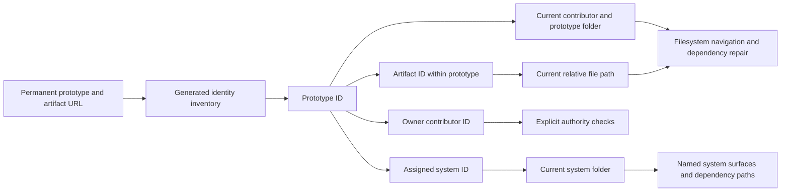

Design Studio uses source identities independent of location, ownership, and naming. This work preserves filesystem-based prototype authoring and system dependency contracts.

## Implemented foundation

Prototype and system public routes use permanent IDs. Source metadata, assignments, ownership, default selection, archive/rebuild relationships, and central grants persist IDs. Browser and Node readers resolve them to current source locations without a mutable-name fallback. Reads, builds, and ordinary saves never invent identities.

Creation and duplication allocate identities explicitly. Copies remap their own permanent references; renames and moves retain identity and preserve supported filesystem dependency repair. Builds reject missing, malformed, and duplicate identities, including archived resources and disabled installed file types. Source writes and Git checks protect retained identities and ownership.

The full migration has a read-only saved preview and a guarded apply command. Directly authored prototype files use a scoped assignment command. Neither mechanism silently repairs malformed metadata or unresolved legacy references.

## Objective

Every prototype, prototype artifact, system, and contributor receives a permanent identity. Location identifies the current source files. Ownership and grants describe authority. Naming remains meaningful to people without controlling permanent identity.

Prototypes and systems remain the two principal collections. Prototype artifacts belong to their prototype. System contents remain identified by meaningful names and relative paths within their system. Components, system documents, skills, fixed surfaces, helpers, and assets do not receive generated child IDs.

## Source identity

The identity format is sixteen lowercase Crockford base32 characters. The alphabet is `0123456789abcdefghjkmnpqrstvwxyz`. Ten cryptographically random bytes provide 80 bits, encoded without truncating a UUID or deriving identity from content, name, time, or owner.

For independent uniform generation, the probability of any collision among n IDs is bounded by `n(n-1)/(2 × 2^80)`. At one million IDs this is approximately `4.14 × 10^-13`; at ten million it is approximately `4.14 × 10^-11`. Validation must still detect duplicates in the retained studio inventory, including archived work and disabled installed file types. These figures describe accidental collision, not authentication or access control.

`src/platform/core/resourceIdentity.ts` owns the format and metadata mechanics. File-type declarations expose their adapter through `FileTypeSpec.identity`.

| Resource | Identity metadata |
| --- | --- |
| Contributor | `studioId` in its profile JSON. |
| Prototype | `studioId` in `meta.json`. |
| System | `studioId` in `system.ts`. |
| React artifact | Leading `/** @studio-id <id> */` comment. |
| Markdown artifact | Top-level `studioId` in frontmatter. |
| Diagram artifact | Leading `%% @studio-id <id>` comment. |
| Canvas artifact | Top-level `studioId` in the scene JSON. |

Creation and explicit migration assign identity. Reading, normal saves, and builds do not invent it. Invalid or duplicate declarations require an actionable error rather than silent replacement. Duplication deliberately creates a new identity and remaps copied internal identity references; ordinary edits preserve it.

## Filesystem parity and dependency integrity

Prototype navigation faithfully reflects actual files and folders. Labels retain existing filename formatting conventions. A Studio rename or move changes the filesystem. External changes appear in Studio. Prototype renaming retains its coordinated title and directory behavior. No independent artifact display-name field is introduced.

Permanent browser routes supplement existing reference repair. Relative imports, Markdown links, assets, and other supported file dependencies still resolve through actual locations. Rename and move operations continue repairing them and reporting unresolved references. A successful identity lookup does not demonstrate dependency integrity.

An artifact may move between folders in its prototype without changing its ID or permanent route. Moving an identified artifact into another prototype is rejected: it would change containment and its parent route. Cross-prototype transfer policy is deferred.

## Routes and generated resolution

The agreed prototype routes are:

```text
/prototypes
/prototypes/<prototype-id>
/prototypes/<prototype-id>/artifacts/<artifact-id>
```

The prototype address displays its first available artifact without redirecting to a standalone artifact route. Source editing retains `?mode=source`. Names and hierarchy remain visible in navigation, rather than duplicated in the canonical URL.

System routes use `/systems/<system-id>` followed by existing surface names or system-relative resource identifiers, such as `/colors`, `/components/button`, `/context/principles`, and `/skills/build-flow/SKILL`. Exposed system names and paths remain deliberate dependency contracts. Structural changes identify affected imports, browser links, documentation, and skills; supported repairs and checks remain required.

The generated manifest resolves identities to current locations and relationships. It is a derived inventory, not another authoring location. Browser and Node resolution share types and rules. Published lookup preserves lazy artifact loading and excludes unavailable publication content. Unknown identities must not become filesystem paths or silently resolve to another resource.

The target resolution flow keeps the authoring tree visible while public references use identity:



This is a full cutover before public release. Existing readable routes do not receive compatibility aliases. Stored references must be migrated to permanent URLs. Copied permanent URLs resolve independently of browser history state. Hosting must continue serving the app fallback for direct routes and configured base paths. See [Publishing](publishing.md).

## Ownership and authority

Prototype metadata references its owner's permanent contributor identity. Existing contributor folders remain the supported source organization convention, with validation requiring owner and location to agree. Filesystem movement does not silently grant ownership.

Admin and system maintainer grants, system assignments, archive provenance, and rebuild source/target relationships refer to permanent identities. `resourceReferences.ts` supplies a strict, read-only projection from persisted IDs to current source selectors and the inverse serializer for managed mutations. Unknown, malformed, duplicate, or wrong-kind identities fail resolution. Runtime readers use that projection; CI resolves grants against the before-side Git tree. Readable source keys remain distinct from those identities. Local operations, CLI inspection, agent guidance, and CI must interpret authority consistently and evaluate proposed authority changes against existing authority.

Future prototype-specific collaborator grants can extend this model. Collaborator controls and permissions are not part of the current refactor. Identity is not web authentication or filesystem isolation. Runtime dependency boundaries remain independent of human authority.

`readPersistedStudioConfig` supplies a fresh strict Node reader with separate persisted declarations and resolved source selectors. The Vite resource-directory plugin supplies only contributor and system ID/location mappings, excluding names, emails, and profile preferences. The browser projects persisted configuration through that directory; the generated directory itself does not evaluate grants.

## Explicit identity operations

Run `pnpm studio identity-audit --json` to inspect current identity declarations, missing metadata, and malformed or duplicate identities. The audit includes archived prototypes and file types retained in installed modules even when disabled. It excludes prototype helpers and does not assign identities, generate a manifest, repair references, or change authority.

The initial audit scope is contributor profiles, system declarations, and contributor-owned prototype trees. Custom module-owned prototype-shaped sections retain their own contracts. Full migration refuses such installations until the section has an explicit identity policy; it does not guess containment or ownership.

Run `pnpm studio identity-plan --out <new-file>` to save a reviewable, composed source preview: metadata, persisted relationships, and stored browser links. It includes exact before/after content, allocated IDs, and a digest inventory of participating source trees and installed module declarations. The output file must not already exist. A new preview allocates new candidate IDs; the saved preview retains its allocation. The command changes no Studio source and refuses installed prototype-shaped module sections until they have an explicit identity policy.

`scripts/lib/resource-identity-migration.js` implements the internal metadata stage. It recomputes the preview from the current inventory rather than trusting arbitrary edits in a saved plan, rejects changed sources and inventory additions/removals, retries generated collisions, verifies the result, and rolls back failed writes. Rollback refuses to overwrite concurrent edits and reports when manual recovery is needed.

`scripts/lib/resource-relationship-migration.js` prepares the relationship stage after source IDs are complete: configuration grants and the default, explicit prototype assignments and owners, archive provenance, and rebuild targets and source identities. It preserves explicit `null` and default omission, retains source keys only for registration/location, and refuses unavailable dependencies requiring reconciliation.

`scripts/lib/resource-foundation-migration.js` composes all stages in an isolated temporary review workspace. Its internal apply recomputes the exact reviewed plan, guards the complete participating inventory, applies the combined edits, verifies relationships and links, and rolls back failures while preserving concurrent edits. Canvas timestamps and nonces replay deterministically from the saved preview. Binary assets are copied and hashed as bytes and never rewritten. Run `pnpm studio identity-apply <reviewed-preview.json> --yes` after reviewing the saved preview. The command requires existing Admin authority and rejects an edited preview or changed inventory before writing. A shared-operation marker coordinates development-server restarts during the transaction. There are no browser compatibility aliases.

Installed systems require a valid `studioId` for runtime resolution. Uninstalled package/scaffold declarations can omit it; installation allocates the instance identity. Plain-data declarations reject duplicate properties at every level, including duplicate identity and permission keys.

## Direct authoring and verification

After creating prototype artifact files directly, run `pnpm studio identify src/prototypes/<contributor>/<prototype> --json` for a preview, then `--yes` to assign missing identities. Existing IDs and declared ownership remain unchanged. The owner or an existing Admin can run it. It assigns the prototype's missing ID/owner when needed and the missing IDs of retained installed file types, including disabled types. It does not assign system children, helpers, or identities outside the chosen prototype.

An ordinary rename or move needs no new identity assignment. Preserve the leading identity comment, Markdown frontmatter field, or canvas metadata when editing. A copied file with a retained ID fails validation; use managed duplication or explicitly create a new artifact. Arbitrary cross-prototype transfer is rejected until an explicit transfer policy exists.

Verify permanent addresses independently of source dependencies. Regression coverage includes identity adapters, scoped parent lookup, copying/remapping, source moves and repair, system lifecycle, grant revocation and before-side CI authority, missing/malformed/duplicate metadata, preview tampering and stale inventories, rollback failures, lazy publication, disabled capabilities, and deployment under a base path. Review rendered navigation, embeds, source mode, and direct refreshes. A successful build alone does not establish dependency integrity.

Comments, revision history, authentication, a database, collaborator UI, and canvas frame selection are deferred. A future `?frame=<element-id>` selection can extend a canvas's permanent route after Excalidraw frame persistence is verified.

## Cutover decisions

The system installation policy is to allocate a new ID for each installed system instance. Package origin and version remain separate provenance; renaming or upgrading that installation preserves its ID. Installing the same package in another studio allocates a different ID. A repository fork retains its source IDs. The person delegated this choice, and this is the selected approach.

The person explicitly chose a full cutover before public release. No legacy browser-route aliases are required. Existing stored links are migrated where supported, and unsupported references must be surfaced for review. New public links use the permanent routes exclusively.
