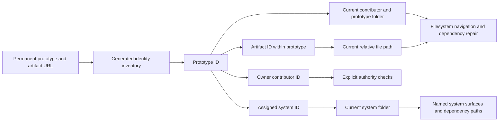

Design Studio is introducing source identities independent of location, ownership, and naming. This work preserves filesystem-based prototype authoring and system dependency contracts.

## Implementation status

The first stages supply identity validation, generation, source metadata adapters, a read-only audit, and a previewable source-metadata migration stage. Canvas saving preserves a declared identity. Current routes, authority, configuration references, and source creation still use their existing contracts. Existing content has not been migrated. Missing identities are reported by the audit, not rejected by normal builds at this stage.

This document records the agreed destination and identifies what remains unimplemented. It does not replace the existing [prototype contract](../../modules/prototypes/README.md), [system contract](../../modules/systems/README.md), or [contributor scope](contributor-scope.md) before their implementations migrate.

## Objective

Every prototype, prototype artifact, system, and contributor receives a permanent identity. Location identifies the current source files. Ownership and grants describe authority. Naming remains meaningful to people without controlling permanent identity.

Prototypes and systems remain the two principal collections. Prototype artifacts belong to their prototype. System contents remain identified by meaningful names and relative paths within their system. Components, system documents, skills, fixed surfaces, helpers, and assets do not receive generated child IDs.

## Source identity

The identity format is sixteen lowercase Crockford base32 characters. The alphabet is `0123456789abcdefghjkmnpqrstvwxyz`. Ten cryptographically random bytes provide 80 bits, encoded without truncating a UUID or deriving identity from content, name, time, or owner.

For independent uniform generation, the probability of any collision among n IDs is bounded by `n(n-1)/(2 × 2^80)`. At one million IDs this is approximately `4.14 × 10^-13`; at ten million it is approximately `4.14 × 10^-11`. Validation must still detect duplicates in the retained studio inventory, including archived work and disabled installed file types. These figures describe accidental collision, not authentication or access control.

`src/platform/core/resourceIdentity.ts` owns the format and metadata mechanics. File-type declarations expose their adapter through `FileTypeSpec.identity`.

| Resource | Identity metadata |
| --- | --- |
| Contributor | `studioId` in its profile JSON, planned for migration. |
| Prototype | `studioId` in `meta.json`, planned for migration. |
| System | `studioId` in `system.ts`, planned for migration. |
| React artifact | Leading `/** @studio-id <id> */` comment. |
| Markdown artifact | Top-level `studioId` in frontmatter. |
| Diagram artifact | Leading `%% @studio-id <id>` comment. |
| Canvas artifact | Top-level `studioId` in the scene JSON. |

Creation and explicit migration assign identity. Reading, normal saves, and builds do not invent it. Invalid or duplicate declarations require an actionable error rather than silent replacement. Duplication deliberately creates a new identity and remaps copied internal identity references; ordinary edits preserve it.

## Filesystem parity and dependency integrity

Prototype navigation faithfully reflects actual files and folders. Labels retain existing filename formatting conventions. A Studio rename or move changes the filesystem. External changes appear in Studio. Prototype renaming retains its coordinated title and directory behavior. No independent artifact display-name field is introduced.

Permanent browser routes supplement existing reference repair. Relative imports, Markdown links, assets, and other supported file dependencies still resolve through actual locations. Rename and move operations continue repairing them and reporting unresolved references. A successful identity lookup does not demonstrate dependency integrity.

An artifact may move between folders in its prototype without changing its ID or permanent route. A move to a different prototype changes containment and its parent route. Cross-prototype transfer and compatibility policy are deferred.

## Routes and generated resolution

The agreed prototype routes are:

```text
/prototypes
/prototypes/<prototype-id>
/prototypes/<prototype-id>/artifacts/<artifact-id>
```

The prototype address displays its first available artifact without redirecting to a standalone artifact route. Source editing retains `?mode=source`. Names and hierarchy remain visible in navigation, rather than duplicated in the canonical URL.

System routes use `/systems/<system-id>` followed by existing surface names or system-relative resource identifiers, such as `/colors`, `/components/button`, `/context/principles`, and `/skills/build-flow`. Exposed system names and paths remain deliberate dependency contracts. Structural changes identify affected imports, browser links, documentation, and skills; supported repairs and checks remain required.

The generated manifest resolves identities to current locations and relationships. It is a derived inventory, not another authoring location. Browser and Node resolution share types and rules. Published lookup preserves lazy artifact loading and excludes unavailable publication content. Unknown identities must not become filesystem paths or silently resolve to another resource.

The target resolution flow keeps the authoring tree visible while public references use identity:



This is a full cutover before public release. Existing readable routes do not receive compatibility aliases. Stored references must be migrated to permanent URLs. Copied permanent URLs resolve independently of browser history state. Hosting must continue serving the app fallback for direct routes and configured base paths. See [Publishing](publishing.md).

## Ownership and authority

Prototype metadata will reference its owner's permanent contributor identity. Existing contributor folders remain the supported source organization convention, with validation requiring owner and location to agree. Filesystem movement does not silently grant ownership.

Admin and system maintainer grants, prototype ownership, and system assignments will refer to permanent identities. Readable source keys remain distinct from those identities. Local operations, CLI inspection, agent guidance, and CI must interpret authority consistently and evaluate proposed authority changes against existing authority.

Future prototype-specific collaborator grants can extend this model. Collaborator controls and permissions are not part of the current refactor. Identity is not web authentication or filesystem isolation. Runtime dependency boundaries remain independent of human authority.

## Read-only inventory audit

Run `pnpm studio identity-audit --json` to inspect current identity declarations, missing metadata, and malformed or duplicate identities. The audit includes archived prototypes and file types retained in installed modules even when disabled. It excludes prototype helpers and does not assign identities, generate a manifest, repair references, or change authority.

The initial audit scope is contributor profiles, system declarations, and contributor-owned prototype trees. Module-owned prototype-shaped sections must be reviewed before the migration command is implemented; the audit does not claim that coverage yet.

Run `pnpm studio identity-plan --out <new-file>` to save a reviewable source-metadata preview, including exact before/after content and allocated IDs. The output file must not already exist. A new preview allocates new candidate IDs; the saved preview retains its allocation. The command changes no Studio source and refuses installed prototype-shaped module sections until they have an explicit identity policy.

`scripts/lib/resource-identity-migration.js` implements the internal metadata stage. It recomputes the preview from the current inventory rather than trusting arbitrary edits in a saved plan, rejects changed sources and inventory additions/removals, retries generated collisions, verifies the result, and rolls back failed writes. Rollback refuses to overwrite concurrent edits and reports when manual recovery is needed. This stage must be composed with relationship and compatibility migration before a public apply command is offered.

System declarations now accept and validate a declared `studioId`; omission remains transitional. Plain-data declarations reject duplicate properties at every level, including duplicate identity and permission keys.

## Remaining rollout

1. Complete identity-preserving creation, source-write checks, duplication, and lifecycle operations. Resolve metadata field translation separately from location keys.
2. Implement a previewable migration with stale-source guards, consistent relationship translation, stored-link migration, and rollback. Resolve each prototype's scope and assigned system before migrating its source.
3. Introduce identity inventories, permanent routes, navigation helpers, embeds, and canvas relationship validation. Keep filesystem dependency repair intact.
4. Integrate authority, agent context, CI baseline checks, installed system handling, and contributor registration. Reject self-authorizing changes.
5. Update owning contracts, skills, and human guidance alongside implemented behavior. Remove transitional ambiguity.

Verify copied links through renames and moves, stopped-server filesystem moves, filesystem parity, duplicate remapping, system dependency repairs, authority spoofing, canvas saves, archives, disabled modules, malformed metadata, rejection of legacy routes, local editing, and static publication. Build success alone is insufficient.

Comments, revision history, authentication, a database, collaborator UI, and canvas frame selection are deferred. A future `?frame=<element-id>` selection can extend a canvas's permanent route after Excalidraw frame persistence is verified.

## Cutover decisions

The system installation policy is to allocate a new ID for each installed system instance. Package origin and version remain separate provenance; renaming or upgrading that installation preserves its ID. Installing the same package in another studio allocates a different ID. A repository fork retains its source IDs. The person delegated this choice, and this is the selected approach.

The person explicitly chose a full cutover before public release. No legacy browser-route aliases are required. Existing stored links are migrated where supported, and unsupported references must be surfaced for review. New public links use the permanent routes exclusively.
