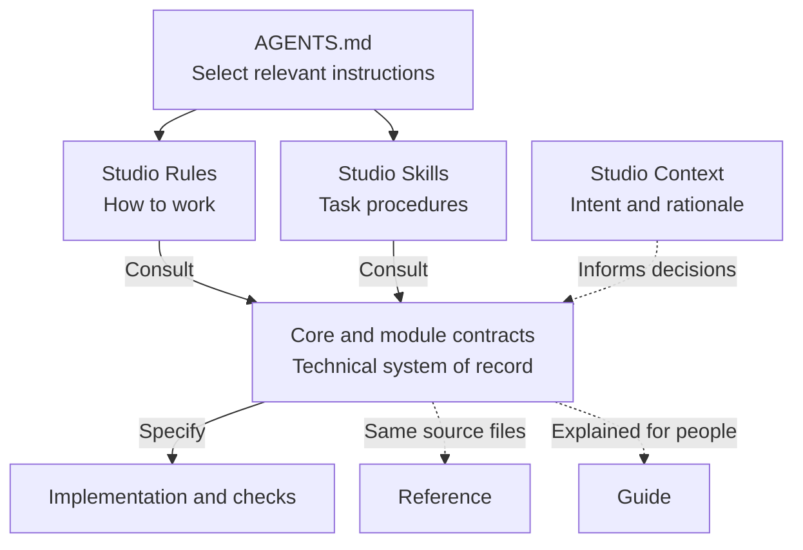

Design Studio has one platform and a Studio system that supports operating it. Platform contracts and Studio instructions describe different responsibilities. They are maintained together, rather than forming two competing sets of platform rules.

## Choose the system of record

| Information | Authoritative owner | Example |
| --- | --- | --- |
| Shared technical structure, behavior, or boundary | Core contract beside `src/platform/core/` | Configuration fields, source access, file-type interfaces. |
| A capability's technical requirements | Contract beside its module | Prototype metadata and dependencies; system theme scoping. |
| Standing requirements for how an agent works | Studio `rules/` | Resolve contributor scope; preserve existing work; verify before committing. |
| A task procedure | Studio `skills/<name>/SKILL.md` | Initialize a studio or document a component. |
| Design Studio intent and decision rationale | Studio `context/` | Design Studio's Principles and Personas. |
| Essential instructions and task selection | Repository and system `AGENTS.md` | Read the applicable rule, skill, and assigned system. |
| An introduction for people | Guide chapter | Explain a capability and link to its detailed contract. |

Reference is a reading surface for core and module documents. Moving a requirement into Reference means placing it in its owning source file, not maintaining a second copy in the app.

A contract can contain requirements, not just descriptions. It defines what valid files and compatible implementations must satisfy. A rule can establish operating policy even when no automated check enforces it. The distinction is the responsibility it governs, not whether it uses the word “must.”

## How the parts connect

Studio context also informs the agent's decisions directly. The diagram shows document responsibilities, not the order in which an agent reads them. See the [agent context contract](agent-context.md) for routing.

The Studio system includes application components and styles as well as operating instructions. Its rules apply to maintaining Studio and to operating prototypes where the repository routes to them. They are not a separate product design system that prototypes inherit.

An assigned Product, Marketing, or team system adds its own product knowledge and conventions. Those instructions work within platform contracts and operating scope. Technical details of that system stay with its code; its context explains the product it serves.

## Keep one definition and useful routes

A rule should tell the agent when to consult a contract and what action to take. Keep schemas, allowed values, dependency matrices, and lifecycle definitions in the owning contract. A short reminder can remain in a rule when needed for safe task selection, with a direct link to the definition.

For example, the [prototype contract](../../modules/prototypes/reference.md#dependency-boundaries) owns permitted dependencies and style boundaries. The [prototype workflow rule](../../systems/studio/rules/prototype-workflow.md) requires reading it before changing runtime code. The [archiving rule](../../systems/studio/rules/archiving.md) tells an agent when to prefer archiving; the prototype contract defines the status field and deployment exclusion.

Studio's [UI copy rule](../../systems/studio/rules/ui-copy.md) owns the editorial policy for action labels. It does not need a duplicate technical contract. [Documentation standards](../../systems/studio/rules/documentation-standards.md) owns writing and verification policy and uses this document to choose the technical owner.

## Change the owner, then its consumers

When supported behavior changes, update implementation, checks, and the owning contract together. Update affected rules, skills, and Guide summaries so they continue to route and describe the work accurately. An authorized platform change may alter a contract; changing a product instruction alone cannot make an incompatible implementation valid.

When operating policy changes, update its Studio rule and affected procedures. When intent changes, update the relevant context. Do not copy a new requirement into every document that mentions the subject.

If a contract, rule, or implementation disagrees, identify the conflicting statement and correct the responsible source. Code shows implemented behavior; it does not prove that intended requirements have been met. Checks enforce selected requirements and do not prove that an agent read or followed instructions.

Follow the [Maintain documentation skill](../../systems/studio/skills/maintain-documentation/SKILL.md) to verify affected sources, links, routing, and rendered content.
