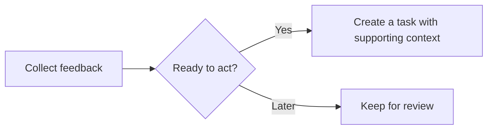
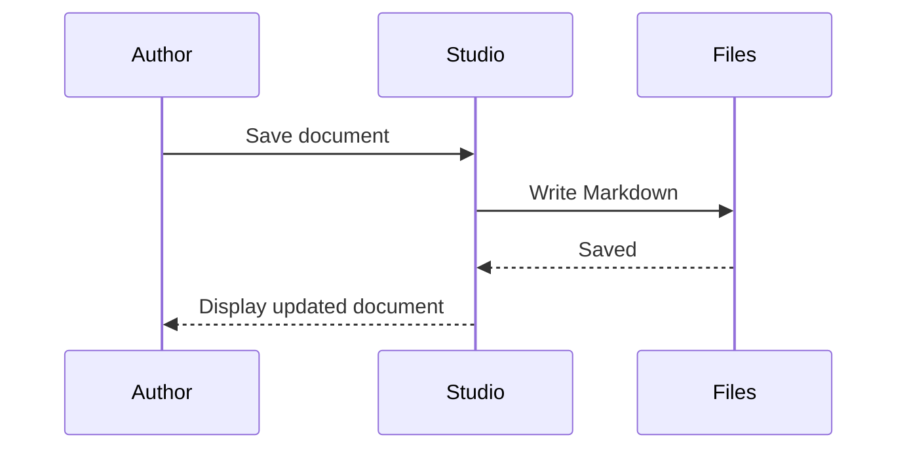
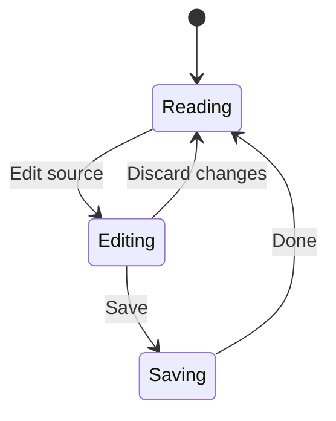
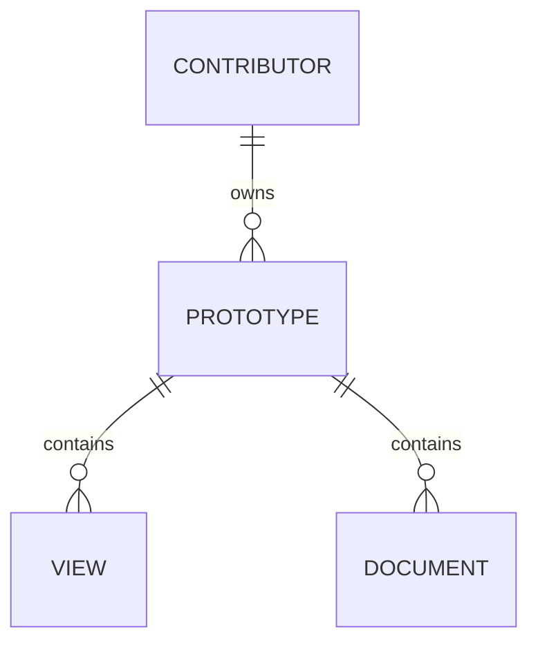
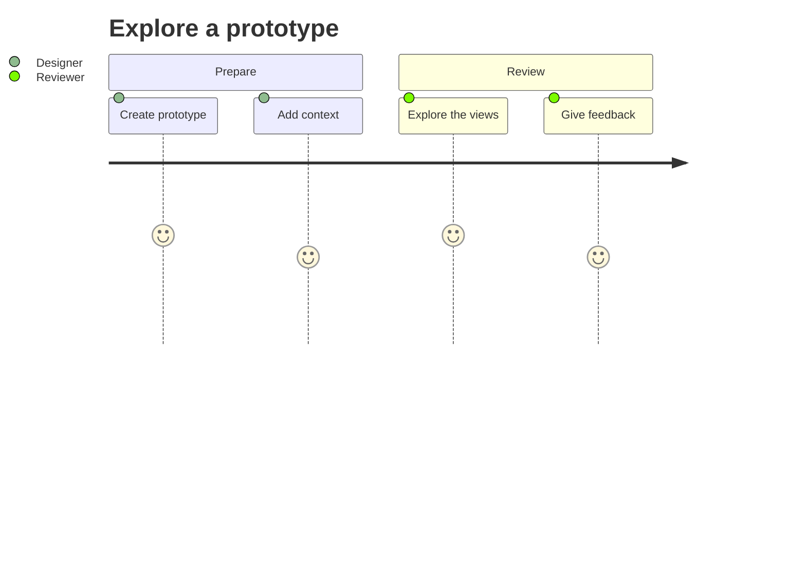
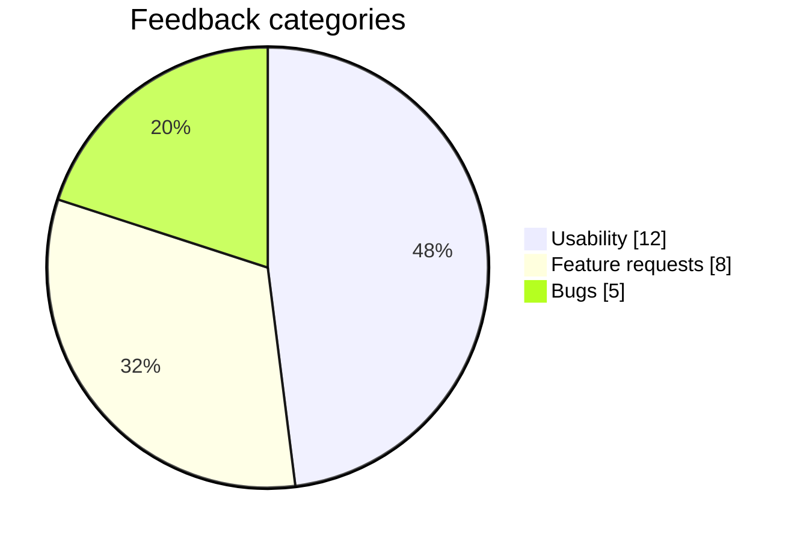
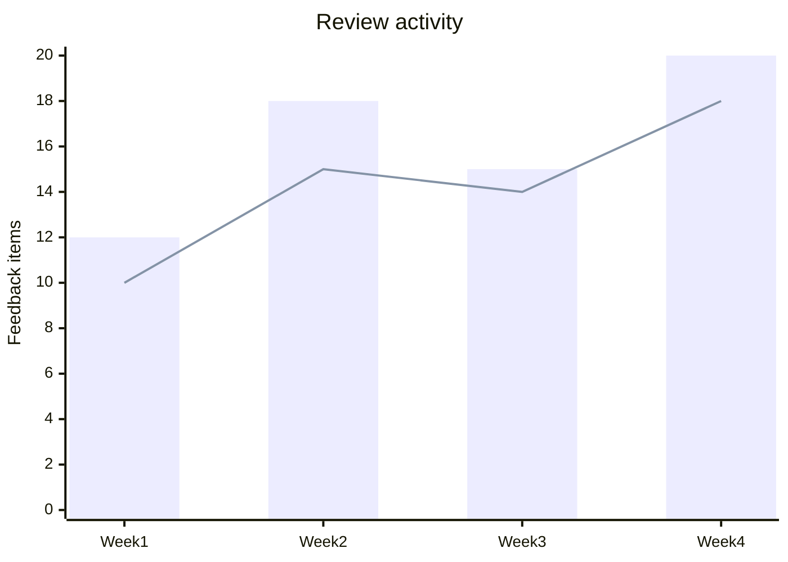

# Diagrams and code

Mermaid blocks render automatically in the Guide, system context, reference pages, and prototype Documents. Write standard Mermaid syntax inside a fenced `mermaid` code block. Expand **Mermaid source** to read or copy an example below.

The starter uses platform neutrals for structural diagrams and Flexoki accents for categories and chart series. Document code and the source editor share those accents. Change the platform's light or dark mode to preview both appearances.

Standalone prototype diagrams use the optional [Diagrams module](/documentation/reference/modules/diagrams/README.md). They share this renderer and theme; Markdown fences remain available when that module is disabled.

## Flowchart



## Sequence



## State



## Entity relationships



## User journey



## Categories

Color distinguishes categories. Labels preserve the meaning without relying on color alone.



## Chart series



## Document code

The same Flexoki color roles appear in highlighted code and the source editor. Language grammars can classify a token differently, so individual tokens may differ.

```ts
// Keep the next step explicit.
export function nextStep(actionable: boolean, count = 3) {
  const label = "Review feedback";
  return actionable ? { label, count } : null;
}
```

## Customize the defaults

Studio owners can edit `src/systems/studio/styles/contentPalette.js` to change the shared accent palette and document syntax color roles. The source editor reads the same palette.

Edit `src/platform/app/diagrams/mermaidTheme.ts` for diagram color roles and `MermaidDiagram.tsx` for renderer defaults. Diagram neutrals resolve from the platform's current CSS theme. The renderer keeps theme and security defaults under platform control. Authors can still use Mermaid's supported diagram styles, such as flowchart `classDef`, to communicate specific meaning.

Support follows the bundled Mermaid version. These examples cover common foundations, not every diagram type or syntax feature. Additional Mermaid integrations, such as external layouts or icon packs, may require platform configuration. Excalidraw uses its own rendering.
