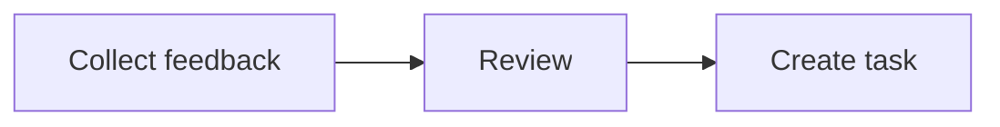

# Documents

Documents adds Markdown pages inside a prototype. It is optional: disabling it hides those pages from normal prototype navigation and preserves their files. The Handbook and Guide retain their own Markdown support.

Documents use the platform's page style, rather than the prototype's design-system theme.

## Create and edit

Ask your agent to create a document, or select **New** (+), then **New document**, in the Artifacts row.

1. Right-click the document and select **Edit source**.
2. Edit the Markdown text.
3. Save with Command+S on macOS or Ctrl+S on other systems.
4. Select **Done** to return to the page.

Other contributors' documents and published pages are read-only.

A document and another artifact cannot share a URL, such as `notes.md` and `notes.tsx`.

## Supported content

The reader supports headings, lists, links, tables, task lists, strikethrough, and highlighted code blocks. It does not execute JSX or embedded components. Raw HTML appears as text. HTML comments are hidden.

Frontmatter is an optional settings block at the start of a Markdown file. It controls the heading, description, and contents list:

```md
---
title: Notes
description: Context for this prototype.
toc: true
---
```

Without a frontmatter title, an opening level-one heading (`# Title`) supplies the title.

### Embed a prototype file

Embed a file from the same prototype using Markdown image syntax on its own line:

```md


```

Each file type supplies its preview, with an **Open** link to the original file. Views show a screen preview; diagrams render their source; canvases show a read-only preview fitted to their contents. Open the original to interact or edit. Documents and types without a preview appear as link cards.

The corresponding module must be enabled. Nested documents can use relative paths such as `../feedback-flow.mermaid`; `.mmd` files also work. Missing files and disabled modules show an unavailable message. References outside the current prototype are not embedded. Inline image syntax within a sentence becomes a link.

Canvas previews retain live views and diagrams, but documents and other canvases inside them stay cards. This keeps nesting bounded.

These references share their original files; no source is copied into the document. Mermaid fences below remain useful for diagrams owned by the document itself.

### Mermaid diagrams

See [Diagrams and code](/documentation/guide/diagrams) for examples, the shared theme, and customization.

Use a fenced code block with the language `mermaid` to show a diagram:



In the Markdown source, put three backticks followed by `mermaid` before the diagram, and three backticks after it.

Diagrams follow the platform's light or dark mode. Expand **Mermaid source** below a diagram to read or copy its text. Invalid syntax shows an error with the source still available. Add `accTitle` and `accDescr` to describe the diagram for assistive technology.

This shared reader also supports Mermaid in the Handbook, Guide, and repository reference pages. It loads Mermaid only when a diagram appears. The Markdown text remains the saved source; no image file is required. Diagram scripts and click actions are disabled.

## Links and related context

Link to another artifact with a relative path:

```md
See the [main view](./prototype.tsx).
Read the [research](./research/notes.md).
```

The app accepts paths with or without extensions. External links open in a new tab. Moving linked files can break relative links. Renaming the prototype folder preserves them.

Documents link to views. Canvases can show live view previews alongside document cards.

Keep prototype-specific context here. The [Handbook](/documentation/guide/handbook) holds context shared across the studio.

## For developers

This optional module owns prototype Markdown. Follow the [module rule](../../../handbook/rules/modules.md) for removal. See the [file-type contract](../../core/fileTypes.md) for extension behavior.

- `type.ts`: what the build reads: the `.md` extension, a template (a title and an empty-document line), and the checks on frontmatter.
- `open.tsx`: the icon, how a document loads, and its page.
- `src/platform/app/docs/`: the shared Markdown reader and page style. The Handbook uses this reader independently.
- `scripts/build/rehype-mermaid.js`: preserves Mermaid fences before code highlighting. The shared reader maps them to `MermaidDiagram.tsx` for lazy SVG rendering.
- `loader.ts`: the glob of document files for the deployed site.

Agent contract: `src/handbook/rules/documents.md`.
