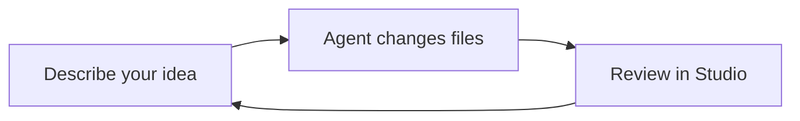

Design Studio brings your prototypes, design system, and team context into one workspace. You own its files and the work you create. Use it on your own or with a team.

You do not need to understand the whole platform to begin. Start with the sample prototype, then ask your coding agent to help create your own.

## Working with your agent

Open the same repository in your coding agent and run Studio alongside it. Describe what you want to explore. The agent changes files; Studio lets you see and interact with the result.

Give the agent your goals, constraints, and feedback. You can work visually while it handles code and technical details.

## Find your way around

| Surface | What you do there |
| --- | --- |
| [Home](/documentation/guide/home) | Find work and search the studio. |
| [Prototypes](/documentation/guide/prototypes) | Explore ideas using screens, writing, diagrams, and canvases. |
| [Systems](/documentation/guide/systems) | Browse components, styles, context, rules, and skills for your prototypes. |
| [Documentation](/documentation/guide/documentation) | Read this Guide or consult detailed platform Reference. |

Run Studio locally to make changes. You can also publish a viewing site when you want to share your work.
