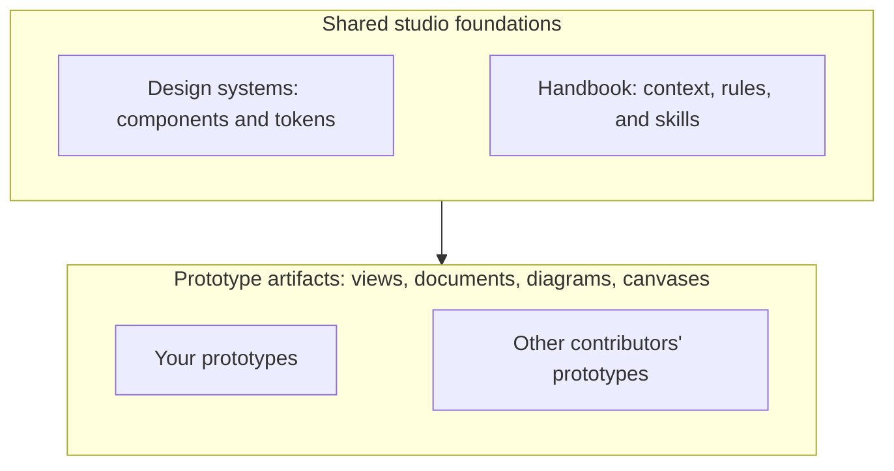

Design Studio is a workspace for designers and product managers who build with coding agents. Use it on your own or with a team. You own the code, your context, and the designs you create.

## An opinionated starting point

Design Studio brings together a selected toolkit so you can begin with fewer setup decisions. Its out-of-the-box setup is:

- React and TypeScript for code-based prototypes.
- Tailwind CSS for styles.
- shadcn/ui components built on Base UI.
- Git and GitHub.
- A coding agent that can read repository instructions, edit files, and run local commands.

It's intentionally designed as a starter kit. So while the platform does depend on parts of its core stack, it aims to be as hackable, customizable, and extendable as possible. You just may need to do a bit more legwork the further you diverge from the defaults.

See [Tech stack](/documentation/guide/tech-stack) for the dependencies and replaceable defaults.

## What the studio provides

| Part | What it provides |
| --- | --- |
| Prototypes | Independent spaces for interactive code-based views and local experiments. |
| Design systems | Components and tokens that help views match your product. |
| Artifact types | Views, documents, diagrams, and canvases that work together inside a prototype. |
| Handbook | Shared context for people and instructions for agents. |
| Modules | Defined places to add, disable, or remove platform capabilities. |

The defaults give you a working toolkit. You can replace them or extend the environment. A prototype can use its design system, start from a blank view, or combine both approaches.

A prototype's navigable pieces of work are its **artifacts**. Each is a file whose type provides its view and preview. Helpers and assets support those artifacts; folders organize them.

## Files are the working environment

Design Studio works with the filesystem and common file types. The local app reads and writes to files on your machine. Changes made by you or your agent appear while the studio runs.

Local use does not require hosting. Publishing produces a site for viewing the work. 
