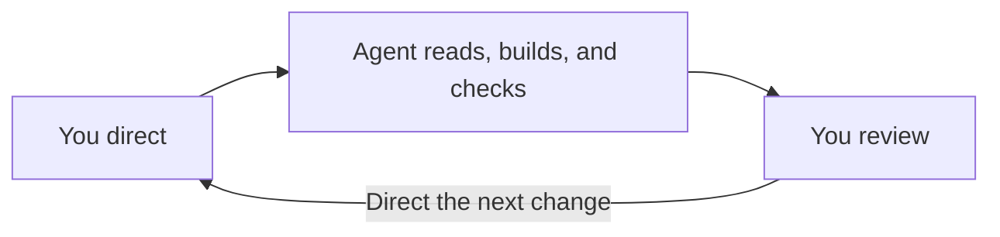

Use your coding agent alongside the local studio. Design Studio does not supply a hosted agent service. Available tools depend on the agent you use.

Describe the outcome and provide relevant context. The agent should perform the work it can do, ask for missing decisions or materials, and make the result available for review. You can direct changes in conversation or edit the result yourself.

## How instructions reach the agent

`AGENTS.md` is the entry point for compatible agents. It references context to read every session and instructions for specific tasks. Ask your agent to read it if the agent does not load it automatically.

| Source | Role |
| --- | --- |
| Handbook Docs | Context for people, agents, or both. |
| Handbook Rules | Standing instructions for agents. |
| Handbook Skills | Procedures for specific agent tasks. |
| Repository scripts | Repeatable operations and checks. |

A file's presence does not guarantee the agent reads it. `AGENTS.md` can point to any of these documents. Ask the agent to add a reference when context should guide future work.

Skill discovery varies by agent. The Handbook holds the skill files for you and your agent to inspect.

## What happens by default

For prototype work, repository instructions tell the agent to identify your contributor folder, create prototypes with `pnpm new`, and keep code within its boundaries. It should run `pnpm build` before committing completed work and push only when you ask to share.

Instructions guide the agent. Git hooks are scripts that run during operations such as a commit. Hooks and build checks inspect the resulting files. They do not enforce every instruction or judge the design.

## Included skills

| Request | Skill |
| --- | --- |
| “Set up my studio.” | `initialize-studio` |
| “Get me set up as a contributor.” | `setup-contributor` |
| “Set up our design system.” | `setup-design-system` |
| “Document this component.” | `document-component` |

You can add your own context, rules, and procedures through the [Handbook](/guide/handbook).
